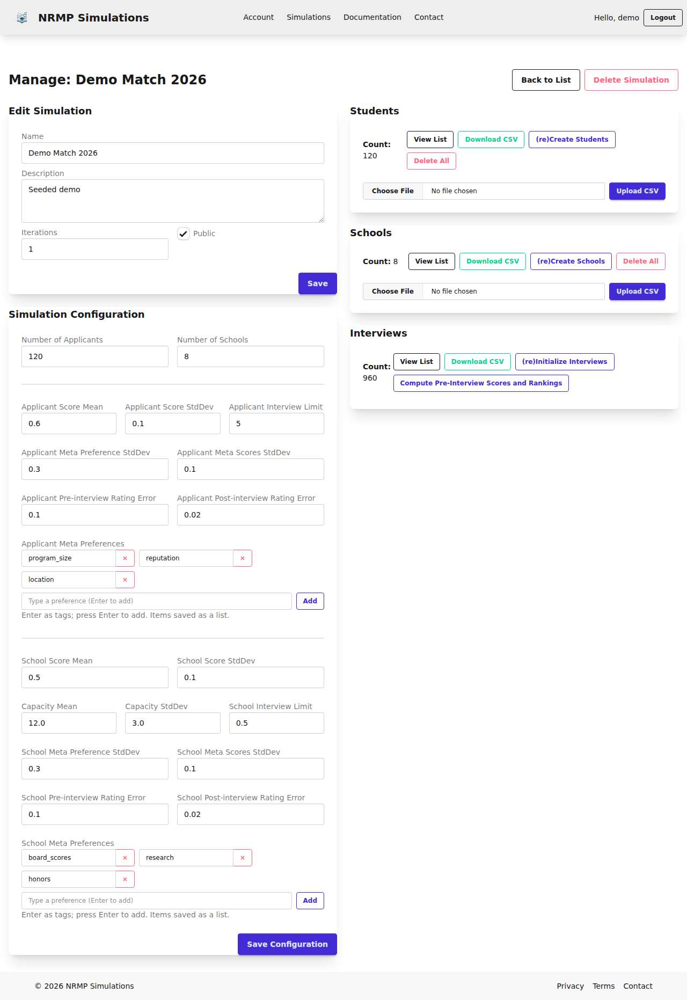
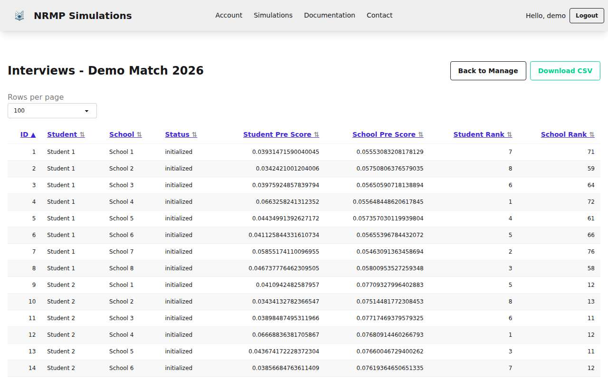
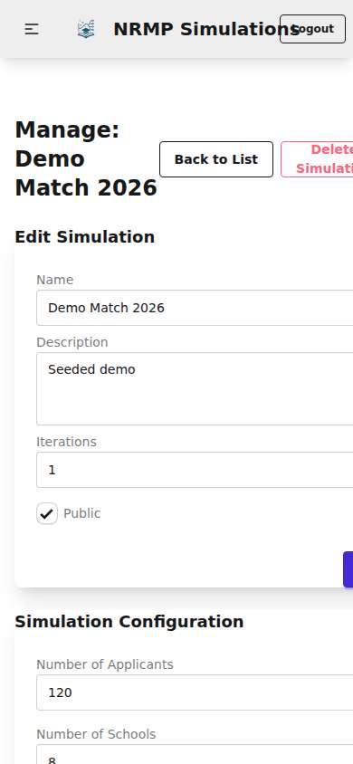
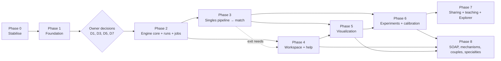

# NRMP Simulated: Project Review and Phased Implementation Plan

*Review date: 2026-09-24. Branch: `claude/project-review-plan-ce86lz`. Codebase reviewed at commit `01b1eb5` (after the dependency bump).*

> **Status (2026-09-25).** The review was written in a cloud session against GitHub `main` (`64ba63c`) plus a
> dependency bump (`01b1eb5`). That session then implemented Phases 0–2 on `claude/project-review-plan-ce86lz`, but
> it could not push, and neither that branch nor `01b1eb5` can be recovered. Only this `docs/` folder survived. The
> plan is being **re-implemented on the branch `implement-review-plan`**, starting from local `main`;
> [IMPLEMENTATION_STATUS.md](IMPLEMENTATION_STATUS.md) tracks progress. [§0](#0-reconciliation-with-this-repository)
> lists what differs between the reviewed code and this repository. The rest of the review is kept as written, so its
> file:line citations refer to the reviewed commit, not to this repository.

This document reviews the project against seven goals:

1. dependency upgrades;
2. completeness of each simulation step;
3. UI/UX;
4. simulation options;
5. plots, graphs, networks and sliders;
6. help and in-context "?" help;
7. other important ideas.

It ends with a phased plan that covers every finding.

| Document | Contents |
|---|---|
| **This file** | Executive summary, findings by goal, phased plan, decisions for the owner |
| [review/FINDINGS.md](review/FINDINGS.md) | Full register of all 189 findings: evidence (file:line), recommendation, verification note, phase |
| [review/A-model-spec.md](review/A-model-spec.md) | Draft v2 **model specification** (utilities, noise, RNG streams, acceptance tests) |
| [review/B-stage-spec.md](review/B-stage-spec.md) | Stage-by-stage **pipeline specification** vs. the real NRMP process, DA/SOAP/couples algorithms, Monte-Carlo semantics |
| [review/C-parameters.md](review/C-parameters.md) | Interim default fixes, old→new parameter mapping, proposed **parameter schema**, calibration targets |
| [review/D-ux-workspace.md](review/D-ux-workspace.md) | Proposed information architecture, **workspace wireframes**, daisyUI 5 component mapping |
| [review/E-visualization.md](review/E-visualization.md) | **Chart catalog**, slider architecture, library selection, data API |
| [review/F-help-system.md](review/F-help-system.md) | **Help system** design, user-guide outline, corrected help text for every field |
| [review/G-engineering.md](review/G-engineering.md) | Settings, CI, Docker and background-job snippets |
| [review/H-todo-ideas-disposition.md](review/H-todo-ideas-disposition.md) | What happens to every item in `TODO.md` and `IDEAS.md` |
| [review/viz-prototype/](review/viz-prototype/) | Working **Match Explorer** prototype: 7 charts, a network, 8 sliders, in-browser DA |
| [review/prototypes/](review/prototypes/) | Reference Python prototypes: the full stage pipeline with DA/SOAP, and a starter test suite |

---

## 0. Reconciliation with this repository

*Added 2026-09-25, when the rebuild started.*

Local `main` has one commit the review never saw: `91fb381`, "Add simulation workflow stages with post-interview
scoring and stage-based UI" (2026-03-21). The rebuild branch also starts with a baseline commit, `8f7bf45`, holding
changes that were uncommitted at the time: static assets built at image build time, `django-storages[s3]`, dependency
bumps and a typo fix. Neither was on GitHub when the review ran.

How these commits change the review's findings:

| Finding | The review says | In this repository | Consequence for the plan |
|---|---|---|---|
| ENG-25 | Migration `0006_alter_student_score` is pending | Committed as `0006_alter_simulation_status_alter_student_score`, followed by the data migration `0007_convert_pending_status`. `makemigrations --check` is clean. | Closed. Step 0.2's migration becomes `0008` and has nothing to absorb. |
| SIM-20, STG-7, UX-6 | `status` never changes; no visible stage | `Simulation.status` has eight stage choices (`setup` … `matched`). Views advance and regress it, and a daisyUI `steps` bar plus one card per stage show it. | Partly closed. Still open: the server does not enforce stage order (only buttons are disabled), status goes stale after cascades (L-2), and steps are not atomic. Steps 0.4 and 2.4 still apply. |
| STG-13 | `interview()` is a stub; post-interview fields are unused | `compute_post_interview_scores_and_rankings()` and four helpers exist, built on the per-row ORM engine | This is the work §9 warns against. The helpers repeat SIM-1 and SIM-7 and never run (L-1). Step 0.3 guards them; step 3.4 replaces them. |
| UX-5 | Population actions refresh only `#population-counts` | Each action re-renders its own stage card, plus the stepper through an out-of-band swap | Partly closed. Other cards, such as the interview count, still go stale after a cascade. |
| ENG-9 | whitenoise and dj-database-url sit in the `prod` group; honcho is a runtime dependency | Both are main dependencies; honcho was removed (dev still gets it through `django-tailwind[honcho]`) | Mostly closed. The image still installs the dev group, and `uv run` in the entrypoint re-syncs at start-up. Step 0.1. |
| ENG-10 | The entrypoint installs and builds at every boot | The Tailwind build and `collectstatic` run at image build time | Partly closed. Still one stage, root user, Node in the final image, no `.dockerignore`. Step 1.2. |
| §2 (Goal 1) | Dependencies bumped in `01b1eb5` (Django 6.1.1 …) | Not present. Locked: Django 6.0.3, logfire 4.31, gunicorn 25.3, django-debug-toolbar 6.2, numpy 2.4.4 | Redo as step 0.0. |
| – | – | `django-storages[s3]` is a dependency but not configured | Keep; nothing in the plan uses it yet. |
| – | `_interview_counts.html` and `_population_counts.html` are the manage-page panels | No page includes them. Four endpoints (`students-rate-pre-interview`, `schools-rate-pre-interview`, `compute-students-rankings`, `compute-schools-rankings`) still render `_interview_counts.html`, but no button calls them. | Dead code (L-3). |

New findings from the reconciliation:

- **L-1 (medium, defect).** "Compute Post-Interview All" only processes interviews with `status="interviewed"`, which
  nothing sets. It writes nothing, yet the view still advances `Simulation.status` to `post_interview`, so the stepper
  shows a finished stage with no data. The helpers also multiply by the rating error (SIM-1). → Step 0.3.
- **L-2 (medium, defect).** Recreating or uploading students or schools cascade-deletes every interview, but
  `advance_status("populations")` never moves backwards. A simulation at `pre_interview` keeps that status with
  0 interviews. → Step 0.4 (regress on every destructive action), then 2.4.
- **L-3 (low, hygiene).** The dead partials and endpoints above. → Steps 1.6 and 1.8.
- **L-4 (high, defect; found during the rebuild).** Each stage card disabled its button until the simulation had
  already *reached* that stage (`stage_locked`), so after generating populations "(re)Initialize Interviews" was
  disabled and the workflow could not be completed from the page at all. It went unnoticed because the step
  endpoints themselves work. → Fixed in Phase 0 (a button is enabled once its prerequisite stage is reached), with a
  test that renders the page at each stage.

Changes to the plan for the rebuild:

1. **Step 0.0 (new):** redo the dependency upgrade (`uv lock --upgrade`, then verify) before Phase 0.
2. **Step 0.3** also covers the post-interview helpers (L-1), and **step 0.4** also fixes L-2.
3. The Phase 0 smoke test is written for pytest-django straight away rather than Django's `TestCase`, so step 1.1 does
   not have to port it.

Deviations made during the rebuild are recorded per step in [IMPLEMENTATION_STATUS.md](IMPLEMENTATION_STATUS.md).

---

## 1. Executive summary

**Where the project is.** NRMP Simulated has a clean, small Django codebase (about 4k lines) and a sensible stack: Django + HTMX + Alpine + Tailwind/daisyUI, deployed on Railway. The domain decomposition (Simulation → Config → Students/Schools → Interviews → Match) maps well onto the real process. The implemented part covers population generation, the full student × school cross-product, pre-interview scoring and pre-interview ranking. Things that already work well:
- ownership checks consistently return 404 to non-owners (verified by test);
- CSRF protection covers HTMX;
- populations use `bulk_create`;
- the HTMX partial pattern is a good base for a richer workspace.

**But the simulation doesn't yet produce meaningful results, and production is fragile.** The most important findings, all verified (CRIT-1 and CRIT-12 by the completeness critic's own experiments):

1. **Production can't run with `DEBUG=False`: every request returns 500** (ENG-1). `NRMP_Simulated/urls.py` always imports the debug-toolbar URLs. `DEBUG` defaults to `"True"` and there is a committed fallback `SECRET_KEY`, so **the deployed site is very likely running in debug mode.** This is pre-existing; the old lockfile behaves the same.
2. **The "rating error" multiplies instead of adding noise** (SIM-1), so observed pre-interview rankings are always identical to the true rankings. The model's main research lever (information friction) does nothing, and an error of 0 is silently treated as ×1.
3. **The first run fails.** The default config fails its own validators, and a new simulation has no config, so "(re)Create Students" silently does nothing (SIM-2, UX-1).
4. **Default spreads are infeasible on the 0–1 Beta scale.** They are silently clamped into U-shaped populations, and requested means are not honoured: 0.7 becomes 0.62, and 0 becomes about 0.30 (SIM-3).
5. **Data loss on upload and round trip** (UX-4, SIM-5, SIM-6):
   - uploads delete the population *before* parsing;
   - a download→upload round trip drops all preferences, so every score is 0 and every rank is a tie;
   - the parser silently drops rows and misreads columns.
6. **It doesn't scale, and concurrent clicks corrupt data** (SIM-7, ENG-3, CRIT-1):
   - per-row saves cost about 4.4 ms per pair, so gunicorn's 30 s timeout hits at about 7k pairs, while the form allows 10M pairs;
   - nothing runs in the background;
   - two concurrent "(re)Create Students" requests double the population (for example from two tabs, or a retry after an apparent hang).
7. **Only about 4 of the 12+ real stages exist.** Applications, signals, invitations, interviews, rank lists, the match algorithm, SOAP and Monte-Carlo iterations are stubs or missing (STG-1, STG-4…STG-17).
8. **Nothing is reproducible** (SIM-18/19, OPT-8):
   - there is no random seed;
   - the config is edited in place with no snapshot;
   - `iterations`, `public` and `status` are dead fields.
9. **Preferences are almost purely vertical**: there is no idiosyncratic term, and weights behave like on/off switches (SIM-12/13, OPT-4). Match outcomes would be artefacts of the model.
10. **UI debt** (UX-8/9/2/10, HELP-1):
    - templates use about 160 class names (daisyUI 4 names plus Bootstrap leftovers) that don't exist in daisyUI 5;
    - the manage, interviews and documentation pages overflow horizontally on mobile;
    - HTMX actions give no feedback and hide errors;
    - the meta-preference editor has a stored self-XSS;
    - the help text that exists is never shown.
11. **"Documentation" is a public dump of model internals**, including `User.password`/permissions metadata, not user help. Several help texts are swapped or wrong (HELP-4/5).
12. **There are no tests, CI or automated dependency updates** (ENG-8, CRIT-12).

**The plan** has nine phases, 0–8 (§9). §10 lists eight owner decisions and when each is needed:
- D0 (check the production environment) and D4 (interim size cap): now;
- D2 (vocabulary): before Phase 1;
- D1, D3, D5 and D7: before Phase 2.

| Phase | Theme | Rough effort (1 developer) |
|---|---|---|
| **0** | Stabilise production, fix first run, stop data loss, patch noise model | ~1 week |
| **1** | Tests + CI, deployment, daisyUI 5 migration, HTMX feedback, CSV v2, email/accounts | ~2 weeks |
| **2** | Decisions → model spec → typed parameters → seeded numpy engine → runs, state machine, background jobs | ~3 weeks |
| **3** | Complete singles pipeline: applications → signals → invitations → interviews → rank lists → DA → validation/metrics | ~2–3 weeks |
| **4** | Tabbed workspace, presets + sliders, help registry, "?" popovers, `/help/` guide, onboarding/demo | ~3 weeks (overlaps 3) |
| **5** | Visualization suite: ECharts + sigma.js, data API, P0 dashboards, network | ~3 weeks |
| **6** | Monte-Carlo, sweeps, A/B, applicant groups, NRMP-2026-calibrated preset, citation/bundles | ~3 weeks |
| **7** | Sharing/gallery, public Match Explorer, classroom mode, DA step-through | ~3–4 weeks |
| **8** | SOAP, alternative mechanisms, couples, tracks, specialties, geography, costs | ongoing |

**How this review was done.**
1. I ran `uvx uv-bump` and verified the result against a baseline built from the previous lockfile (§2).
2. I seeded a demo simulation, took desktop and mobile screenshots, and started a local dev server.
3. Seven independent reviewers, one per review dimension, each read the code, ran experiments in isolated databases, and built prototypes. The dimensions were engine, stages, UX, visualization, help, options and engineering. Goal 2 had two reviewers, and goal 1 was done by me (step 1).
4. Each reviewer's findings went to a separate **skeptical verifier** told to *refute* them.
5. A **completeness critic** checked coverage against the seven goals.

Result: 189 findings (75 defects, 67 gaps, 47 recommendations). A skeptical verifier checked each of the 174 reviewer findings:
- none was refuted outright;
- 118 were confirmed;
- 56 were corrected in detail;
- 22 had their severity changed.

This document uses the corrected versions. The 15 completeness-critic findings (CRIT-*) rest on the critic's own experiments. After correction: 4 critical, 54 high, 91 medium, 40 low. A final pass by three more checkers (facts, model maths, plan consistency) then corrected this document itself.

---

## 2. Goal 1: Dependency upgrade (`uvx uv-bump`), applied

`uv-bump` raised every minimum in `pyproject.toml` to the latest feasible release and refreshed `uv.lock`. It is **committed on this branch (`01b1eb5`)**.

| Package | Lock before → after | Notes |
|---|---|---|
| django | 5.2.6 → **6.1.1** | Major. Brings template partials, built-in CSP and the `django.tasks` API (all new in 6.0), which the plan uses. `` and `LoginRequiredMiddleware` were already available (since 5.1). |
| django-htmx | 1.24.1 → 1.29.0 | `` can replace the hand-vendored htmx |
| django-tailwind | 4.2.0 → 4.5.0 | Tailwind build verified |
| logfire[django] | 4.6.0 → 5.1.0 | Major |
| scipy | 1.16.2 → 1.18.1 | numpy is now 2.5.3 (transitive) |
| gunicorn / psycopg / whitenoise / dj-database-url | 23.0 → 26.2 / 3.2.10 → 3.3.6 / 6.11 → 6.12 / 3.0.1 → 3.1.2 | prod group |
| django-debug-toolbar | 6.0.0 → 8.0.0 | Major (dev) |
| django-stubs / mypy / pytest / ruff / ty | 5.2.3 → 6.1.1 / 1.18 → 2.3.1 / 8.4 → 9.1.1 / 0.13 → 0.16.8 / 0.0.1a20 → 0.0.84 | dev |
| cookiecutter / django-browser-reload | 2.6 → 2.7.1 / 1.19 → 1.21 | dev |

**Verification.** I compared the upgraded stack with an environment built from the old lockfile:
- `manage.py check` is clean.
- An **end-to-end smoke test** covers every page, signup/login, simulation CRUD, config save, population create/upload/download round trip, every interview step, all list/sort/pagination views, CSV exports, admin, delete and logout. It behaves **identically** on Django 5.2.6 and 6.1.1 in DEBUG mode. It also behaves identically in production mode (`DEBUG=False`) when run with a test settings override that works around the pre-existing crashes described below.
- gunicorn 26 serves requests.
- The Tailwind/daisyUI build succeeds.
- No deprecation warnings.
- ruff: the same 138 findings before and after.
- `mypy nrmps --ignore-missing-imports`: 135 → 132 errors. `mypy .` reports 138 on the bumped tree; once the django-stubs plugin is configured, 22 real errors remain (ENG-12).
- `ty check nrmps` (alpha): 38 → 86 diagnostics, informational only.

**Pre-existing problems surfaced while verifying.** Both reproduce on the *old* lockfile, so they are not regressions:
- `DEBUG=False` crashes every request because of the unconditional debug-toolbar import (ENG-1). The `logfire.configure()` no-token error also affects both versions.
- A pending migration: `makemigrations --check` wants `0006_alter_student_score` (ENG-25).

**What `uv-bump` does not cover** (CRIT-12, ENG-11):
- the npm toolchain: tailwindcss 4.1.13 → 4.3.3, daisyUI 5.1.12 → 5.7.44, cross-env 7 → 10, postcss-cli 11 → 12;
- the hand-vendored `static/js/htmx.mini.js` (2.0.6 → 2.0.11) and `alpine_mini.js` (3.14.9 → 3.17.4).

Upgrade these in Phase 1 *after* the daisyUI 5 class migration (UX-8), so layout changes can be attributed. Add Dependabot or Renovate for uv, npm and GitHub Actions once CI exists. Also watch `django-tasks-db` (recommended for background jobs): it declares support only up to Django 6.0. A reviewer ran it successfully on 6.1.1, so pin it and test it in CI.

I also updated `CLAUDE.md`: "Django 5.2+" now reads "Django 6.1+", and a note under *Current Implementation Status* points to this plan and warns against building the stubs on the current engine.

---

## 3. Goal 2: Simulation steps, completeness review

### 3.1 Stage-by-stage status

| # | Stage in the real process | In the app today | Status | Key findings |
|---|---|---|---|---|
| 1 | Configure market | `SimulationConfig` form | **Broken defaults**, edited in place, no snapshot | SIM-2, SIM-18, STG-10, OPT-1 |
| 2 | Generate / upload populations | `create_students/schools`, CSV upload | Works, but distributions are wrong and uploads lose data | SIM-3, SIM-12, SIM-14, SIM-15, SIM-5, SIM-6 |
| 3 | True preferences (ground truth) | implicit in `_score`; `*_true_score_*` fields never written | **Missing** | SIM-9, SIM-13, STG-2, STG-3 |
| 4 | Pre-interview observation + ranking | rate + rank steps | Implemented, but **noise has no effect**; key-mismatch 500s; ties by DB order; O(rows) queries | SIM-1, SIM-4, SIM-10, SIM-7 |
| 5 | Applications (ERAS) | none: full cross-product | **Missing** | STG-4, OPT-5, SIM-8 |
| 6 | Preference signals (gold/silver) | unused `student_signal` field | **Missing** | STG-5, OPT-15 |
| 7 | Screening + interview invitations (waves) | unused `school_invited`; `school_interview_limit` capped below 1 per position | **Missing; unit wrong** | STG-6, OPT-6, OPT-16 |
| 8 | Applicant accept/decline under interview cap | unused `student_accepted`, `applicant_interview_limit` | **Missing** | OPT-17 |
| 9 | Interviews + post-interview update | `interview()` stub; post fields unused | **Missing** | STG-13 |
| 10 | Rank order lists (strict, ≤300) | `students_rank()` / `schools_rank()` stubs | **Missing** | STG-14, OPT-18 |
| 11 | Match: applicant-proposing deferred acceptance | `match()` stub; `Match` table never written | **Missing** | STG-1, STG-19 |
| 12 | Validation + NRMP statistics | none | **Missing** | STG-15, VIZ-10 |
| 13 | SOAP (post-match offer rounds) | none | Missing (Phase 8) | STG-17 |
| 14 | Monte-Carlo iterations | `iterations` field is displayed but unused | **Missing** | STG-9, OPT-10 |
| 15 | Couples, tracks/supplemental lists, reversions, specialties | none | Missing (Phase 8) | STG-18, STG-22, STG-23 |
| — | Pipeline state machine, guards, staleness, locking | `status` fields never change; steps run in any order; not atomic | **Missing** | SIM-20, STG-7, CRIT-1 |

### 3.2 Problems in the implemented steps

- **Noise model** (SIM-1).
  - The current formula is `observed = Σ(meta × weight) × rating_error`. Multiplying by a positive constant never changes an order, so 30/30 students' observed rankings equal their true rankings.
  - `x or 1.0` turns an error of 0 into ×1.
  - Fix (Phase 0.3): `observed = U + N(0, σ)` using a numpy `Generator`; σ = 0 must mean "perfect information". The seed field and per-stage streams arrive in Phase 2.2.
- **Beta generation** (SIM-3). Any stddev above √(μ(1−μ)) is cut to 90% of that limit, and α, β are floored at 0.1. Every shipped score and meta-score stddev default (2, 10, 2 and 2) triggers this, which gives U-shaped populations and moves the mean. About 40% of generated applicants (31–44% across samples) end up above 0.99, which violates `Student.score`'s own `MaxValueValidator(0.99)`; that only works because `bulk_create` skips validation.
- **Cross-wired attribute keys** (SIM-4, OPT-13).
  - Student attribute keys come from `school_meta_preference`, and school attribute keys from `applicant_meta_preference`.
  - Edit one list, regenerate one side, or upload a CSV, and rating crashes with a generic `Exception(...) from None`. The user sees a 500 that HTMX doesn't show, and the step is left half-written.
- **Preference weights** (SIM-12). `clip(gauss(1, 3), 0.01, 2)` puts about 74% of raw weights exactly on a clamp bound, so "diversity" behaves like switching random attributes on and off. Replace it with a Dirichlet draw with a concentration knob.
- **Consensus** (SIM-13, STG-3, OPT-4). There is no idiosyncratic ("fit") component, and pairwise Spearman between students' true rankings is 0.66–0.99 depending on settings. In the seeded demo every student ranks the same school first. Add a common/idiosyncratic split with one correlation knob per side.
- **Capacity** (SIM-15). The Gaussian allows 0-seat programs (2.6% at 20 ± 10) and a negative mean. Market tightness (positions per applicant) is never shown.
- **Interview-limit units** (SIM-16, STG-6). `school_interview_limit` is a fraction ≤ 0.99 of capacity: 2 interviews for 20 positions by default. Real programs interview roughly 10 applicants per position; that order-of-magnitude figure still needs confirming per specialty against the NRMP Program Director Survey.
- **Ranking** (SIM-10). Ties are broken by DB row order, which differs between SQLite and Postgres, and stale ranks aren't cleared. Every student is ranked against every school, even schools they never applied to.
- **Performance** (SIM-7, ENG-3). Each rating step does one autocommitted UPDATE per row, and each ranking step adds one SELECT per student or school. 400 × 25 takes 43.9 s for "Compute pre-interview". A vectorised numpy prototype does 100k pairs in about 0.5 s, versus about 440 s extrapolated for the current engine (about 900× faster), and gives identical ranks.
- **Provenance** (SIM-18, SIM-19). There is no seed, and generation mixes `random` with scipy's global RNG. The form edits the only config row in place, so nobody can tell which parameters produced the current data.

### 3.3 What to build

[Appendix B](review/B-stage-spec.md) gives the full specification. For each stage it lists purpose, inputs, decision rule (pseudo-code), outputs, new fields, parameters, guards and validation checks. It also includes:
- the applicant-proposing DA algorithm, oracle-checked against the `matching` package on 20/20 instances and taking 0.04 s at 10k × 1k;
- stability, optimality and rural-hospitals checks;
- SOAP, reversions, supplemental lists, and a Roth–Peranson-style couples extension (a stable matching was found in 9/10 markets at the 2026 couples share);
- Monte-Carlo semantics.

[Appendix A](review/A-model-spec.md) is the single **model specification** the engine, help formulas, presets and any browser port must share (CRIT-2). Reviewer prototypes used three slightly different utility models, so this decision comes first.

---

## 4. Goal 3: UI/UX review

| | |
|---|---|
|  |   |

*Left: the current manage page is one long page with two separately saved forms and 20 unexplained parameters next to the actions. Right: the interviews table shows 16-digit floats, status stuck at "initialized" and scores of about 0.03–0.08 caused by the noise bug. On mobile, the page overflows horizontally.*

**Defects to fix first** (Phases 0–1):
- **First run** (UX-1). The first run is blocked twice in a row. "(re)Create Students" silently does nothing, because a new simulation has no config. Then saving the untouched default config fails with two validation errors on fields the user never touched.
- **HTMX feedback** (UX-2, ENG-16). HTMX actions have no spinner and never disable their buttons. There is no success message, and 4xx/5xx responses are never swapped in, so errors are invisible.
- **Long steps** (UX-3). A 300 × 30 compute took 38.6 s in one request, past the production timeout.
- **Stale panels** (UX-5, HELP-7). Regenerating students cascade-deletes every interview, but the Interviews panel keeps showing the old count. The confirm text doesn't mention the cascade.
- **Dead CSS classes** (UX-8). About 160 uses of classes have no rules in daisyUI 5.1: daisyUI 4 names such as `form-control`, `label-text` and `*-bordered`, plus the Bootstrap classes `card-header` and `text-muted`. Forms depend on accidental layout, and error messages overlap. These classes have been dead since daisyUI 5 was adopted; the dependency bump didn't cause this.
- **Mobile overflow** (UX-9). Four root causes: grids without `grid-cols-1`, the `nowrap` `.label` text, button rows that can't wrap, and the oversized docs heading. On the documentation page, long method signatures outside any overflow wrapper also overflow (HELP-6). The navbar brand overlaps the buttons on every page.
- **Self-XSS** (UX-10, ENG-7). The meta-preference lists render as a Python repr through `|safe` inside HTML attributes. That is a demonstrated stored self-XSS, and without JavaScript it breaks the form.
- **Tables and navigation** (UX-13, UX-16, UX-19):
  - raw floats and dict reprs;
  - hard-coded URLs;
  - "Account" shown when logged out;
  - no active nav state;
  - outline buttons fail WCAG contrast (1.96:1).
- **Account** (UX-15). A wrong password shows only "Please correct the errors below", and "Change password" dead-ends in the admin.

**Redesign** (Phase 4; [Appendix D](review/D-ux-workspace.md) has wireframes):
- Replace the manage page with a **simulation workspace**: breadcrumbs, a stage badge, a daisyUI `steps` stepper (Setup → Population → Applications → Interviews → Rank lists → Match → Results), a job/progress bar, **"Next step"** and **"Run all remaining"** buttons, per-step KPI `stats`, chart cards and filterable tables.
- Rebuild the setup form with **presets**, paired **range sliders + number inputs**, a live **market summary** (positions per applicant, interview slots) and distribution previews.
- Add **detail pages** per applicant and program, **filters**, numbered pagination, **Duplicate/Compare**, a real landing page with **"Try a demo"**, and dark mode.

---

## 5. Goal 4: Improved simulation options

**Problems with today's parameters** (OPT-1…OPT-14):
- The defaults are invalid, and the units are undefined ("stddev 10" on a 0–1 scale).
- Six parameters do nothing: both interview limits, both post-interview errors, `iterations` and `public`.
- The attribute lists are named after the *other* side.
- Market tightness is an accident of three unrelated inputs.
- Preference correlation is an accident of clamping.

Reviewers built a numpy prototype of the proposed pipeline, which runs 2,400 × 300 in about 1 s. The new knobs move outcomes a lot:

| Change | Result |
|---|---|
| Preference correlation 0 → 0.95 | First-choice share 72% → 28% |
| Top-N vs. portfolio application strategy | Match rate 0.77 vs. 0.92 (an upper bound: the prototype assumed applicants know their exact percentile) |
| 80 applications with single-round invitations | Match rate falls to 0.83; invitation backfill recovers about ⅔ of the drop |

These numbers come from an uncalibrated prototype; they show how much the knobs matter, not real-world levels.

**Proposed parameter model.** [Appendix C](review/C-parameters.md) has the full table (about 50 parameters with type, default, range, meaning and stage). It is a **typed, versioned schema** (pydantic) grouped by stage, and it drives validation, the form, the "?" help, presets and JSON import/export:

| Group | Key options |
|---|---|
| `run` | seed (shown; SeedSequence streams per stage and replicate), replicates, resample population vs. only process noise, CI level |
| `market` | applicants, **applicants per position** (NRMP 2026: 1.08), program-size distribution (min 1) |
| `applicants` / `programs` | **groups** (US MD / DO / US-IMG / non-US-IMG, with shares and strength), program tiers, attributes with a per-attribute correlation to overall quality |
| `prefs` | **preference correlation** per side (common vs. idiosyncratic), Dirichlet weight concentration, optional geography bonus |
| `info` | pre-interview noise per side, **interview informativeness** κ, interview fit shock |
| `apps` | count distribution and mean, **strategy** (top-N / reach-target-safety portfolio) with noisy self-assessment, later fee schedule and budget |
| `signals` | tiers (e.g. IM 3 gold + 12 silver), allocation strategy, program use share, use in ranking (default no, per AAIM) |
| `invites` | **interviews per position** (default 10), screening strategy and thresholds, yield protection, **waves with backfill** |
| `interview` | applicant cap (default 12), acceptance order, date conflicts |
| `rol` | applicant and program policies, do-not-rank share, length ≤ 300 |
| `match` | applicant- vs. program-proposing, compare both, later couples, SOAP and alternative mechanisms |

Priorities:
- **Must**: fix defaults, noise and seeding; snapshots; the schema; the core stage parameters; Monte-Carlo.
- **Should**: signals, invitations, interviews, rank lists, groups, presets (including one **calibrated to NRMP 2026** aggregates), sweeps, clone/import/export.
- **Could**: specialties, couples, SOAP, geography, costs and adaptive strategies.

---

## 6. Goal 5: Plots, graphs, networks and sliders

*The **working prototype** in [`review/viz-prototype/`](review/viz-prototype/) runs the whole planned pipeline plus deferred acceptance in a Web Worker. It has 7 ECharts charts (Sankey funnel, rank achieved, match by score decile, program fill, assortativity heatmap, true-vs-observed scatter, and a Monte-Carlo sweep band), a sigma.js bipartite network with an ego view, and 8 sliders. At 1,000 × 100 the worker recomputes in about 35–80 ms and ECharts re-renders in another 45–67 ms, so a slider update takes about 80–150 ms end to end. It uses its own simple utility model, not the repo's; see its README.*

**Key conclusions** ([Appendix E](review/E-visualization.md) has the 34-chart catalog and details):
- **Data comes first (VIZ-1, VIZ-2, VIZ-7).**
  - *What can be built today:* population charts, plus a few diagnostics (true vs. observed, pre-rank correlation, first-choice demand) using true utilities derived from the stored weights and attributes.
  - *What can't:* every outcome chart needs data the engine never writes (true scores, application/invite/accept flags, match rows, run records).
  - *What today's data would show:* degenerate charts: observed/true = 0.1 exactly, Spearman 1.000, and in the seeded demo one program every student ranks first.
  - *So:* the first charts double as engine checks. A few diagnostic charts land with the Phase 3 stages (step 3.8), and the full suite follows in Phase 5.
- **Libraries (VIZ-4).**
  - **Apache ECharts 6.1** (368 KB gz, Apache-2.0) is the single chart library. It covers Sankey, heatmap, visualMap/dataZoom sliders, brush linking, timeline animation, dark mode and ARIA. Ternary plots can be drawn by projection.
  - **sigma.js 3 + graphology** (WebGL, MIT) is the network library.
  - Vendor both under `static/vendor/` like htmx and Alpine; no bundler is needed.
  - Rejected: Plotly (4× larger for the needed features), Vega-Lite (no Sankey or WebGL), Chart.js and Observable Plot (too limited for linked interaction), Cytoscape (fine for small graphs only).
- **Catalog, P0 first:**
  - population: requested vs. realised distributions, market tightness, live config preview;
  - true vs. observed scatter with rank correlation;
  - first-choice demand vs. capacity;
  - applied→invited→interviewed→ranked→matched **Sankey**;
  - interviews per applicant;
  - **P(match) vs. rank-list length** (in the style of NRMP's *Charting Outcomes*);
  - rank achieved;
  - match rate by score decile;
  - program fill;
  - applicant-decile × program-decile heatmap;
  - KPI tiles with Monte-Carlo intervals.

  Later: stability/welfare/regret metrics, the network (a sorted two-column layout by default, ego networks, a tier graph at scale; ForceAtlas2 only for clustered markets), sweeps with bands, A/B small multiples, and 2-parameter heatmaps.
- **Sliders use three architectures** (VIZ-6):
  - (a) Client-side filtering and scrubbing of precomputed data: hover, brushing, sweep scrubbing.
  - (b) Server recompute via HTMX with debounce. It uses a **stage-aware cache**, so only stages downstream of the changed parameter rerun (DA takes about 2–40 ms even at 10k × 1k), and **common random numbers**, so a slider changes only its own effect and not the noise. It runs synchronously up to about 2k × 200 and as a background job beyond that.
  - (c) An in-browser JS port for a public teaching Explorer, **parity-tested** against the Python engine.

  Build (a) and (b) first, and (c) in Phase 7.
- **Backend and prerequisites** (VIZ-3, VIZ-5, VIZ-12, VIZ-13):
  - aggregate server-side and never send per-pair rows;
  - use a columnar JSON API with ETags and caching;
  - store runs sparsely;
  - fix the static pipeline (compressed manifest storage, `@source not` for vendored JS);
  - escape tooltip content (CSV names can inject HTML into custom formatters).

---

## 7. Goal 6: Help page and "?" in-context help

**Today** (HELP-1…HELP-7):
- The only help is `/documentation/`, a public auto-generated dump of `models.py`. It lists `User` password and permission internals and 30 Django auth methods, leaves out the simulation engine, overflows on mobile, and its CSS is broken under daisyUI 5.
- No model or form `help_text` is rendered anywhere (the only visible hint is a static "Enter as tags…" line under the two tag editors), so all 17 `aria-describedby` references on the manage page point at nothing.
- Much of the help text is wrong: 8 Interview fields read as swapped, "Pre-interview" appears on a post-interview field, "percent" is used for a fraction, there are typos, and the rating-error help calls the value a stddev although the engine multiplies by it.
- Six parameters do nothing, and nothing says so.
- Destructive buttons don't say what they delete.

**Design** (Phases 1 and 4; [Appendix F](review/F-help-system.md) has the architecture, a corrected help-text table for every field, and markup):
1. **Single source of truth**: `nrmps/help/registry.py`, with `FieldHelp`, `ActionHelp`, `ColumnHelp`, `ChartHelp` and `PageHelp` entries. Ranges and defaults are read from model and schema metadata so they can't drift. A Django system check flags missing entries, defaults outside validators, and dead anchors. Each entry has a **status** (`active` / `planned` / `known-issue`), so unused parameters show a "Not used yet · Stage N" badge.
2. **Accessible "?" popover** per field, action, column and chart. It is built on daisyUI 5 `dropdown`/popover, not a hover-only tooltip, so it works with keyboard, screen readers and touch. It shows short text, long text, the formula (KaTeX), range, default, typical values and "Learn more →". The short text also appears under the input so `aria-describedby` resolves.
3. **Per-page help panel**: a navbar "?" or the `?` key opens a side dialog loaded lazily via HTMX, with "What this page is / Do this next / What each button changes / Columns".
4. **`/help/` user guide** in markdown + KaTeX:
   - getting started;
   - how the real NRMP works;
   - the model with formulas and **executable worked examples** (tested, so they can't go stale);
   - generated parameter and CSV references with sample files;
   - experiment recipes, FAQ and glossary;
   - About (assumptions, version, how to cite).

   The developer reference moves behind staff login.
5. **Guided first run**: a stage checklist, a "Try the example" preset, live distribution previews next to inputs, and an optional tour.

Also: choose **one vocabulary**, Applicant/Program, instead of the mix of Student/School and applicant/program (HELP-19, OPT-23). In NRMP usage a "school" is where applicants come from.

---

## 8. Goal 7: Other important ideas

- **Security and production** (ENG-1, ENG-2, ENG-5, CRIT-6, CRIT-11):
  - fix `DEBUG`, `SECRET_KEY`, the toolbar URLs and logfire;
  - add the proxy/HTTPS settings (`SECURE_PROXY_SSL_HEADER`: without it, the CSRF origin check can fail behind Railway's TLS proxy);
  - add login throttling (django-axes) and quotas on heavy actions (anyone can sign up and ask for 10M rows);
  - fail fast when `DATABASE_URL` is missing (production would otherwise silently use SQLite on ephemeral disk);
  - add a health check and backups.
- **Concurrency and integrity** (CRIT-1, SIM-20): make destructive steps atomic, lock per simulation, allow one active job per simulation, and use `hx-sync`/`hx-disabled-elt`.
- **Background execution** (ENG-4, UX-3): the built-in **`django.tasks` API with the `django-tasks-db` backend**, a worker service on Railway, a `SimulationRun` model with progress, and HTMX polling. This needs no Redis.
- **Testing and CI** (ENG-8, ENG-12, ENG-13, HELP-24, VIZ-20):
  - pytest-django, hypothesis property tests (stability, capacity, applicant-optimality), factories and characterisation tests;
  - GitHub Actions running ruff, format, mypy with the django-stubs plugin (138 → 22 real errors), `makemigrations --check`, `check --deploy`, and pytest on SQLite + Postgres;
  - a Playwright smoke test with axe and a 390 px overflow check.

  A starter suite is in [`review/prototypes/`](review/prototypes/); it immediately catches 2 real bugs.
- **Deployment** (ENG-9, ENG-10, ENG-11):
  - the dependency groups are wrong: `whitenoise` sits in `prod` but is always imported, and the image installs the dev group;
  - the entrypoint runs installs and builds at every boot;
  - no manifest/compressed static storage.

  Fix with a multi-stage Dockerfile, non-root user and pre-deploy migrations ([Appendix G](review/G-engineering.md)).
- **Privacy, legal and trust** (CRIT-4, CRIT-5):
  - the privacy page is inaccurate: uploads outlive deletion, names reach logs, and Logfire isn't disclosed;
  - there is no account deletion or data export;
  - there is **no NRMP® non-affiliation disclaimer** or "results are not predictions" notice on a site branded "NRMP Simulations". Get legal advice on the name before a wider launch.
- **Reproducibility and research outputs** (CRIT-8, CRIT-9): a Django-free engine package with a CLI (`manage.py nrmp_run --params … --seed …`); experiment bundles (params, seed, model/engine version, results); `CITATION.cff`, CHANGELOG, releases with a DOI; version stamping on every run and chart.
- **Sharing and teaching** (CRIT-3, CRIT-10): visibility (private/unlisted/public), share links, gallery and fork. **Do it after** a data migration sets `public=False` on existing rows. `public` defaults to True and is pre-checked on the form, so existing simulations are very likely `public=True` without meaningful consent. Also a **classroom mode**: participants submit rank lists, the instructor runs the match, with a DA step-through animation and "explain my match". There is also a no-signup public Explorer.
- **Mechanism comparison** (CRIT-14): RSD, immediate acceptance, TTC and program-proposing DA on the same seeded market. This answers the classic "why does the NRMP use DA?" question.
- **Code quality and hygiene** (ENG-14, ENG-19, ENG-22, ENG-23, ENG-24, ENG-26):
  - the ownership check is copy-pasted 20 times, so centralise it;
  - register the admin;
  - use Django 6 template partials and the `` tag (available since 5.1);
  - split `engine/`, `services/` and `tasks/`;
  - remove stray files (`identifier.sqlite`, `templates/base.html.bak`) and git-ignore `data/`;
  - fix the stale statements in CLAUDE.md;
  - add a README.

---

## 9. Phased implementation plan

Each step lists the findings it closes; [FINDINGS.md](review/FINDINGS.md) has the evidence and exact recommendation for each. Every one of the 189 findings is assigned to at least one step; the first assignment is its "home" phase. Efforts are rough, for one developer.

**Critical path and blocking edges.**
- D0 and D4 come before Phase 0, and D2 before Phase 1.
- The model spec (D1/CRIT-2) blocks the engine rewrite, browser previews, help formulas, calibrated presets and the Explorer.
- D7 fixes the pair-level RNG design in Phase 2.2, so it can't wait for Phase 7.
- The Run/snapshot schema blocks outcome charts, Monte-Carlo, citation stamping and sharing results.
- Background jobs plus the per-simulation lock block raising the size caps.
- CI and characterisation tests block the engine rewrite.
- The daisyUI 5 class migration blocks the front-end dependency bump and the help components.
- Email blocks password reset and verification.
- The `public=False` migration blocks the gallery.

**Do not build `interview()`, `students_rank()`, `schools_rank()` or `match()` on the current per-row ORM engine** (as `TODO.md` suggests). That work would be thrown away in Phase 2.

### Phase 0: Stabilise production, fix the first run, stop data loss

*Effort: ~1 week (all S).* **Goal:** The site runs safely with `DEBUG=False`, a new user can go from signup to pre-interview rankings without hitting an error, the one implemented stage produces meaningful numbers, and no action silently loses data.

| Step | Work | Closes |
|---|---|---|
| **0.1** | **Fix production mode.** **Do D0 first** (§10: set `SECRET_KEY`, confirm `DATABASE_URL`). Then guard `debug_toolbar_urls()` (and wire or remove `django_browser_reload`) behind `settings.DEBUG`; default `DEBUG` to False (document `DEBUG=True` for local development); no fallback `SECRET_KEY` outside DEBUG; `logfire.configure(send_to_logfire='if-token-present', console=False)`; `SECURE_PROXY_SSL_HEADER`, secure cookies, HSTS (start at 3600 s); raise `ImproperlyConfigured` at startup if `DATABASE_URL` is missing when not DEBUG (an explicit `sqlite:///…` URL is allowed, and the image build step and the SQLite CI job use one); move `whitenoise`/`dj-database-url` into main dependencies and build the image with `--no-dev --group prod`. Commit a smoke test: a Django `TestCase` in `nrmps/tests.py`, run by `manage.py test` until 1.1 moves it to pytest, using `override_settings(DEBUG=False)`, that GETs every page and runs create → generate → compute. Snippets in Appendix G. | [ENG-1](review/FINDINGS.md#eng-1), [ENG-2](review/FINDINGS.md#eng-2), [ENG-9](review/FINDINGS.md#eng-9), [CRIT-11](review/FINDINGS.md#crit-11) |
| **0.2** | **Make the first run work.** Valid interim defaults (Appendix C §1) in one migration that also absorbs the pending `0006`; `description` `blank=True`; `public` default False plus a data migration setting existing rows to False; create a `SimulationConfig` inside `simulation_create`; a clear message instead of "Count: 0" when no config exists. Add the test `SimulationConfigForm(model defaults).is_valid()`. | [SIM-2](review/FINDINGS.md#sim-2), [OPT-1](review/FINDINGS.md#opt-1), [HELP-2](review/FINDINGS.md#help-2), [ENG-18](review/FINDINGS.md#eng-18), [UX-1](review/FINDINGS.md#ux-1), [UX-18](review/FINDINGS.md#ux-18), [ENG-25](review/FINDINGS.md#eng-25), [CRIT-3](review/FINDINGS.md#crit-3) |
| **0.3** | **Patch the implemented pre-interview stage so its output means something.** Additive Gaussian noise (`observed = U + N(0, σ)`, σ = 0 exact) from a numpy `Generator` (seeding arrives in 2.2); drop the `or 1.0` fallbacks; write the true-score fields; deterministic tie-break (score desc, id); clear stale ranks. Run a `validate_population()` key check that returns the counts partial with an error alert (HTTP 200, or `HX-Retarget` to an alert region, because htmx doesn't swap 4xx/5xx until the 1.5 handler exists) instead of a masked 500. This is a small patch to the legacy engine; Phase 2 replaces it. | [SIM-1](review/FINDINGS.md#sim-1), [STG-2](review/FINDINGS.md#stg-2), [OPT-2](review/FINDINGS.md#opt-2), [SIM-9](review/FINDINGS.md#sim-9), [SIM-4](review/FINDINGS.md#sim-4), [STG-11](review/FINDINGS.md#stg-11), [SIM-10](review/FINDINGS.md#sim-10), [STG-12](review/FINDINGS.md#stg-12) |
| **0.4** | **Make destructive steps atomic, fast enough and bounded.** `transaction.atomic()` plus `select_for_update()` on the simulation around every delete/rebuild; `bulk_update` instead of per-row `.save()`, or better a single `executemany` UPDATE plus a window-function `UPDATE … FROM` for ranks; keep exception causes (`raise … from exc`); `hx-disabled-elt` and `hx-sync` on step buttons. Add a temporary cap on applicants × programs sized from a measurement after this step, so every step finishes within about half the gunicorn timeout (roughly 15–40k pairs with ORM `bulk_update`, more with the SQL path; D4). Clamp `page_size`; stream CSV exports. | [CRIT-1](review/FINDINGS.md#crit-1), [SIM-20](review/FINDINGS.md#sim-20), [ENG-3](review/FINDINGS.md#eng-3), [SIM-7](review/FINDINGS.md#sim-7), [ENG-5](review/FINDINGS.md#eng-5), [ENG-16](review/FINDINGS.md#eng-16) |
| **0.5** | **Close the XSS.** Render meta lists with `json_script`, drop `\|safe`, validate list items server-side (≤ 10 unique keys matching `^[a-z0-9_]{1,40}$`, the same rule the help text states) and raise `ValidationError` instead of silently returning `[]`. | [UX-10](review/FINDINGS.md#ux-10), [ENG-7](review/FINDINGS.md#eng-7) |
| **0.6** | **Stop upload data loss.** Parse and validate the in-memory upload *before* deleting anything, inside one transaction; cap uploads at 5 MB and 50k rows; reject files with row-level errors, or whose resulting applicants × programs would exceed the interim cap; stop writing to `data/`. (The full CSV v2 format is step 1.7.) | [UX-4](review/FINDINGS.md#ux-4), [ENG-6](review/FINDINGS.md#eng-6) |
| **0.7** | **Honest public pages and error hygiene.** NRMP® non-affiliation disclaimer and a "simulated outcomes are not predictions" notice; correct the privacy page (server-side storage, Logfire as a processor, retention) and the Terms page (acceptable use: no real applicant data); use ids instead of participant names in engine exception and log messages, and configure Logfire scrubbing and `instrument_django(excluded_urls=…)`; static `404.html`/`500.html` templates (no DB or context access); fix the home page Quick Start ("Log in via the Admin"); real contact and issue links. | [CRIT-5](review/FINDINGS.md#crit-5), [CRIT-4](review/FINDINGS.md#crit-4), [UX-17](review/FINDINGS.md#ux-17), [HELP-14](review/FINDINGS.md#help-14), [UX-24](review/FINDINGS.md#ux-24), [HELP-21](review/FINDINGS.md#help-21) |
| **0.8** | **Account basics.** Render `non_field_errors` on login; `PasswordChangeView` at `/account/password/` (needs no email); django-axes login throttling behind the proxy. | [UX-15](review/FINDINGS.md#ux-15), [ENG-20](review/FINDINGS.md#eng-20), [CRIT-6](review/FINDINGS.md#crit-6) |

**Exit criteria:** The committed smoke test passes with `DEBUG=False`. `check --deploy` shows only the accepted warnings (`security.W005`/`W021`: HSTS subdomains and preload, deliberately off at first). New simulation → generate → compute works with the defaults, and every step at the interim cap finishes within half the gunicorn timeout. σ = 0 gives observed == true, and σ > 0 gives Spearman < 1. No `|safe` on user data. A failed upload changes nothing.

### Phase 1: Quality foundation and UI hygiene

*Effort: ~2 weeks.* **Goal:** Every later change is protected by CI. The front end uses valid daisyUI 5 markup, works at 390 px and gives feedback for every action. Uploads round-trip. Accounts are self-service. (Needs decision D2.)

| Step | Work | Closes |
|---|---|---|
| **1.1** | **Tests, CI and linters.** pytest-django, hypothesis and factory-boy; characterisation tests that pin current behaviour; GitHub Actions: ruff and format check, mypy with the django-stubs plugin, `makemigrations --check`, `check --deploy`, pytest on SQLite and Postgres; pre-commit; codespell with a project dictionary. Fix the ruff config (py313, google docstrings, exclude migrations) and make one formatting commit. Start from `docs/review/prototypes/suite_prototype.py` and the Phase 0 smoke test. | [ENG-8](review/FINDINGS.md#eng-8), [ENG-12](review/FINDINGS.md#eng-12), [ENG-13](review/FINDINGS.md#eng-13), [HELP-24](review/FINDINGS.md#help-24) |
| **1.2** | **Deployment and operations.** Multi-stage Dockerfile (CSS and `collectstatic` at build time with an explicit SQLite `DATABASE_URL`, non-root, no dev group), `.dockerignore`, pre-deploy `migrate`, `/healthz`, gunicorn workers and timeout from env, `CompressedManifestStaticFilesStorage`, a single log handler, Postgres backups, optional docker-compose with Postgres for local parity; git-ignore `data/`; remove `identifier.sqlite`, `templates/base.html.bak` and the duplicated `.junie` guide. | [ENG-10](review/FINDINGS.md#eng-10), [ENG-11](review/FINDINGS.md#eng-11), [ENG-21](review/FINDINGS.md#eng-21), [ENG-24](review/FINDINGS.md#eng-24), [CRIT-11](review/FINDINGS.md#crit-11), [VIZ-5](review/FINDINGS.md#viz-5) |
| **1.3** | **Front-end dependencies.** After step 1.4: `npm update` (daisyUI 5.1 → 5.7, Tailwind 4.1 → 4.3), refresh htmx 2.0.11 and Alpine 3.17.4 (or use ``), `static/vendor/<lib>/<version>/` with `@source not`, Dependabot for uv/npm/actions; shrink the 363 KB logo and favicon. | [CRIT-12](review/FINDINGS.md#crit-12), [VIZ-5](review/FINDINGS.md#viz-5), [UX-25](review/FINDINGS.md#ux-25) |
| **1.4** | **daisyUI 5 migration and one field component.** A `field_row` include (`fieldset`/`legend`, rendered `help_text` with the `_helptext` id, errors with the `_error` id, `whitespace-normal` hints); remove every class name with no rule in daisyUI 5 (daisyUI 4 names and Bootstrap leftovers), with a CI check that fails on class names missing from the built CSS; fix the overflow causes (including the long signatures on the docs page); a Playwright check (`scrollWidth ≤ 390`) and axe baseline; contrast, labels and ARIA fixes. | [UX-8](review/FINDINGS.md#ux-8), [UX-9](review/FINDINGS.md#ux-9), [HELP-1](review/FINDINGS.md#help-1), [HELP-6](review/FINDINGS.md#help-6), [UX-19](review/FINDINGS.md#ux-19) |
| **1.5** | **Feedback, confirmation and navigation.** Toast region (messages framework plus `HX-Trigger` events), `hx-indicator` spinners, a global `htmx:responseError` handler; one confirm modal that states *what will be deleted, with counts*; refresh all panels after cascades; `` everywhere, active nav, skip link, one h1 per page; number-format filter; unambiguous column headers; dark-mode toggle. | [UX-2](review/FINDINGS.md#ux-2), [ENG-16](review/FINDINGS.md#eng-16), [UX-20](review/FINDINGS.md#ux-20), [HELP-7](review/FINDINGS.md#help-7), [UX-5](review/FINDINGS.md#ux-5), [UX-16](review/FINDINGS.md#ux-16), [UX-13](review/FINDINGS.md#ux-13), [HELP-16](review/FINDINGS.md#help-16), [UX-23](review/FINDINGS.md#ux-23) |
| **1.6** | **Correct copy, one vocabulary, mark unused parameters, delete dead code.** UI labels in the D2 vocabulary (Applicant/Program); apply the corrected help text (Appendix F §C–D, written for the post-Phase-0 state); an error summary with labels and links; a "Not used yet" badge on inactive parameters; correct engine docstrings; delete the no-op and dead code. | [SIM-11](review/FINDINGS.md#sim-11), [STG-24](review/FINDINGS.md#stg-24), [HELP-4](review/FINDINGS.md#help-4), [HELP-20](review/FINDINGS.md#help-20), [SIM-22](review/FINDINGS.md#sim-22), [SIM-23](review/FINDINGS.md#sim-23), [HELP-3](review/FINDINGS.md#help-3), [HELP-17](review/FINDINGS.md#help-17), [OPT-12](review/FINDINGS.md#opt-12), [HELP-19](review/FINDINGS.md#help-19), [OPT-23](review/FINDINGS.md#opt-23) |
| **1.7** | **CSV I/O v2.** One module used by both download and upload; symmetric columns including `meta_preference`; header required; `utf-8-sig`; per-row validation with line numbers; a round-trip test; sample and template files. | [SIM-5](review/FINDINGS.md#sim-5), [SIM-6](review/FINDINGS.md#sim-6), [HELP-15](review/FINDINGS.md#help-15), [OPT-13](review/FINDINGS.md#opt-13) |
| **1.8** | **View structure and admin.** `Simulation.objects.owned_by()` plus a `get_owned_simulation()` helper, `LoginRequiredMiddleware`, one step-dispatcher view; register models in the admin; template partials and ``; annotate list counts (N+1); numbered pagination with totals. | [ENG-14](review/FINDINGS.md#eng-14), [ENG-19](review/FINDINGS.md#eng-19), [ENG-22](review/FINDINGS.md#eng-22), [ENG-15](review/FINDINGS.md#eng-15), [UX-14](review/FINDINGS.md#ux-14) |
| **1.9** | **Email and account lifecycle.** Email backend (console in dev, provider in prod); required, unique (case-insensitive) email for new accounts (form validation plus a conditional `UniqueConstraint(Lower('email'), condition=~Q(email=''))`), and a prompt for existing users without one; email verification for new accounts; password reset; account deletion and "download my data"; delete the legacy upload files in `data/`. | [CRIT-7](review/FINDINGS.md#crit-7), [CRIT-4](review/FINDINGS.md#crit-4) |
| **1.10** | **Documentation hygiene.** README and `.env.example`; update CLAUDE.md (status, commands, architecture); replace `TODO.md` with a pointer to this plan (Appendix H); add a minimal public `/help/` page (quick start, CSV format, known limitations, contact) and point the renamed Help nav item at it; move the generated model reference to `/help/developer/` for staff and 301-redirect `/documentation/`. | [HELP-22](review/FINDINGS.md#help-22), [ENG-26](review/FINDINGS.md#eng-26), [CRIT-15](review/FINDINGS.md#crit-15), [HELP-5](review/FINDINGS.md#help-5), [UX-12](review/FINDINGS.md#ux-12) |

**Exit criteria:** CI is required and green. Playwright smoke and axe pass with no serious violations. The dead-class check passes. No horizontal overflow at 390 px. Every action shows progress and a result. Download → upload is lossless. Password reset and account deletion work end to end.

### Phase 2: Decisions, model spec, typed parameters, seeded engine, runs and background jobs

*Effort: ~3 weeks.* **Goal:** One authoritative, seeded, vectorised engine behind a typed parameter schema. Every result is an immutable, reproducible run executed off the web process.

| Step | Work | Closes |
|---|---|---|
| **2.0** | **Owner decisions and the model spec.** Settle D1, D3, D5 and D7 (§10; D0, D2 and D4 were settled earlier). Write `docs/model_spec.md` from Appendix A and give it a `model_version`; implement the legacy-data strategy; set the version-stamping scheme. | [CRIT-2](review/FINDINGS.md#crit-2), [CRIT-13](review/FINDINGS.md#crit-13), [CRIT-9](review/FINDINGS.md#crit-9) |
| **2.1** | **Typed, versioned parameter schema.** pydantic `SimulationParams` grouped by stage, with cross-field validation (including a guard on applicants × programs), replacing the 20 flat columns (mapping in Appendix C §2). Correct units: interviews per position ≥ 1, applicant interview cap, capacity ≥ 1 (lognormal sizes rescaled to hit the positions total), applicants-per-position input, attributes defined once, Dirichlet weights, a valid Beta or z-scale parameterisation. | [OPT-9](review/FINDINGS.md#opt-9), [OPT-3](review/FINDINGS.md#opt-3), [OPT-14](review/FINDINGS.md#opt-14), [OPT-6](review/FINDINGS.md#opt-6), [SIM-3](review/FINDINGS.md#sim-3), [SIM-12](review/FINDINGS.md#sim-12), [SIM-14](review/FINDINGS.md#sim-14), [SIM-15](review/FINDINGS.md#sim-15), [SIM-16](review/FINDINGS.md#sim-16), [SIM-17](review/FINDINGS.md#sim-17), [STG-6](review/FINDINGS.md#stg-6), [STG-25](review/FINDINGS.md#stg-25), [VIZ-9](review/FINDINGS.md#viz-9), [OPT-12](review/FINDINGS.md#opt-12) |
| **2.2** | **Seeded numpy engine package.** `nrmps/engine/` with pure functions: `rng` (SeedSequence streams per replicate and stage for population-level draws; the counter-based (seed, stream, i, j) generator of Appendix A §3 for pair-level draws, per D7), `population`, `utility` (common + idiosyncratic, D1), `observe`, `rank` (seeded lexsort), persistence adapters; `manage.py nrmp_run` and `seed_demo`; the acceptance tests from Appendix A §9; strict mypy for `nrmps/engine/`. | [SIM-24](review/FINDINGS.md#sim-24), [OPT-11](review/FINDINGS.md#opt-11), [STG-20](review/FINDINGS.md#stg-20), [SIM-19](review/FINDINGS.md#sim-19), [STG-8](review/FINDINGS.md#stg-8), [OPT-7](review/FINDINGS.md#opt-7), [ENG-17](review/FINDINGS.md#eng-17), [SIM-13](review/FINDINGS.md#sim-13), [STG-3](review/FINDINGS.md#stg-3), [OPT-4](review/FINDINGS.md#opt-4), [ENG-23](review/FINDINGS.md#eng-23), [CRIT-8](review/FINDINGS.md#crit-8) |
| **2.3** | **Run model and sparse storage.** `SimulationRun` (params snapshot and hash, seed, model and engine version, status, metrics), `StageRun`, `RankListEntry`, `MatchResult`; rows only for applied pairs; npz arrays for dense matrices; `Applicant`/`Program` naming for the new tables (D2); legacy v1 per D3; composite indexes. | [SIM-18](review/FINDINGS.md#sim-18), [STG-10](review/FINDINGS.md#stg-10), [OPT-8](review/FINDINGS.md#opt-8), [SIM-21](review/FINDINGS.md#sim-21), [STG-16](review/FINDINGS.md#stg-16), [VIZ-2](review/FINDINGS.md#viz-2), [SIM-8](review/FINDINGS.md#sim-8), [VIZ-3](review/FINDINGS.md#viz-3), [VIZ-17](review/FINDINGS.md#viz-17), [HELP-19](review/FINDINGS.md#help-19), [OPT-23](review/FINDINGS.md#opt-23), [ENG-15](review/FINDINGS.md#eng-15), [CRIT-13](review/FINDINGS.md#crit-13) |
| **2.4** | **Stage state machine.** Stage enum, prerequisite guards, staleness from param and population hashes, "re-run from stage X"; a pipeline service that feeds the UI stepper. | [SIM-20](review/FINDINGS.md#sim-20), [STG-7](review/FINDINGS.md#stg-7), [UX-6](review/FINDINGS.md#ux-6) |
| **2.5** | **Background execution, quotas and operations.** `django.tasks` with the `django-tasks-db` backend (pinned and CI-tested on Django 6.1), a worker service on Railway, a one-active-run-per-simulation constraint, HTMX progress polling. A shared `CACHES` (DatabaseCache, `createcachetable` in the pre-deploy command) for rate limits and quota counters; `django-ratelimit` on signup and heavy POST actions; a signup honeypot; per-user quotas (unverified accounts get none); then raise the size caps. Opt-in "run finished" email; a Logfire span per engine stage; a worker heartbeat in `/healthz`; a periodic cleanup task; a staff-only ops page in the admin (runs per day, failures, p95 duration, quota use). | [ENG-4](review/FINDINGS.md#eng-4), [UX-3](review/FINDINGS.md#ux-3), [CRIT-1](review/FINDINGS.md#crit-1), [ENG-5](review/FINDINGS.md#eng-5), [CRIT-6](review/FINDINGS.md#crit-6), [CRIT-7](review/FINDINGS.md#crit-7), [CRIT-11](review/FINDINGS.md#crit-11) |

**Exit criteria:** The same seed gives byte-identical results. Changing a noise parameter leaves the population unchanged. A 10k × 1k pre-interview stage completes in a worker within the D4 budget. Legacy simulations still open (if D3 keeps v1).

### Phase 3: Complete singles pipeline to a validated match

*Effort: ~2–3 weeks.* **Goal:** Applications through the match run end to end on the Phase 2 engine. Every run is checked for stability and records NRMP-style statistics. `docs/review/prototypes/pipeline_proto.py` is a working reference.

| Step | Work | Closes |
|---|---|---|
| **3.1** | **Applications.** `top_n` and reach/target/safety `portfolio` strategies with noisy self-assessment (`apps.self_assessment_noise_sd`), application-count distribution. | [STG-4](review/FINDINGS.md#stg-4), [OPT-5](review/FINDINGS.md#opt-5) |
| **3.2** | **Signals.** Gold/silver tiers, allocation strategy, screening boost; signals not used for ranking by default. | [STG-5](review/FINDINGS.md#stg-5), [OPT-15](review/FINDINGS.md#opt-15) |
| **3.3** | **Screening, invitations and acceptance.** Interviews per position, invitation waves with backfill, screening thresholds and yield protection; applicants accept up to their cap, optionally with date conflicts. | [OPT-16](review/FINDINGS.md#opt-16), [OPT-17](review/FINDINGS.md#opt-17), [STG-6](review/FINDINGS.md#stg-6) |
| **3.4** | **Interviews and post-interview update.** Fit shock plus reduced noise (informativeness κ), optional no-shows. | [STG-13](review/FINDINGS.md#stg-13) |
| **3.5** | **Rank order lists.** Applicant and program policies, do-not-rank, strict order, length ≤ 300, certification; applicant strategy variants (truthful, `truncate_k`, `likelihood_weighted`). | [STG-14](review/FINDINGS.md#stg-14), [OPT-18](review/FINDINGS.md#opt-18) |
| **3.6** | **Match.** Our own applicant-proposing DA (and program-proposing for comparison); the `matching` package as a dev-only oracle on small instances; MatchResult rows including unmatched applicants. | [STG-1](review/FINDINGS.md#stg-1), [STG-19](review/FINDINGS.md#stg-19), [SIM-22](review/FINDINGS.md#sim-22) |
| **3.7** | **Validation and metrics.** Blocking pairs = 0, capacity, ROL consistency and rural-hospitals checks; the NRMP-style and welfare/friction metric set; hypothesis property tests; a generated validation report. | [STG-15](review/FINDINGS.md#stg-15), [VIZ-10](review/FINDINGS.md#viz-10), [VIZ-1](review/FINDINGS.md#viz-1), [CRIT-9](review/FINDINGS.md#crit-9) |
| **3.8** | **Diagnostic charts as stages land.** Vendor ECharts early (`static/vendor/` is ready from 1.3) with a minimal `nrmp-charts.js`; on every run, build POP-1 (requested vs. realised distributions), POP-4 (market tightness), RAT-1 (true vs. observed), RAT-3 (first-choice demand) and the INT-1 funnel. They double as engine sanity checks. The full suite follows in Phase 5. | [VIZ-7](review/FINDINGS.md#viz-7) |

**Exit criteria:** The full pipeline runs at 10k × 1k in a worker within the D4 memory budget and a stated time budget (for example ≤ 60 s). Every run stores `blocking_pairs = 0` and the metric set. The oracle and property tests are green. The diagnostic charts show no degenerate inputs for the presets.

### Phase 4: Workspace UX and help system

*Effort: ~3 weeks (can start alongside Phase 3 once the state-machine API is fixed; the exit needs Phase 3 complete).* **Goal:** A new user gets from signup to a finished match with no outside docs, and every field, action, column and page explains itself.

| Step | Work | Closes |
|---|---|---|
| **4.1** | **Simulation workspace.** Tabbed stepper layout, job bar, per-step KPIs and tables, applicant and program detail pages, filters, "Next step" and "Run all remaining" (Appendix D). | [UX-7](review/FINDINGS.md#ux-7), [UX-14](review/FINDINGS.md#ux-14) |
| **4.2** | **Setup form.** Rendered from the schema: presets, paired sliders and number inputs, live market summary, distribution previews as server-rendered inline SVG or a small JS SVG path (no chart library needed), dirty-state guard. | [UX-21](review/FINDINGS.md#ux-21), [HELP-13](review/FINDINGS.md#help-13), [VIZ-8](review/FINDINGS.md#viz-8), [OPT-20](review/FINDINGS.md#opt-20) |
| **4.3** | **Help registry and "?".** `nrmps/help/registry.py` plus system checks, with strings in `gettext_lazy`; accessible popover per field, action and column; per-page help panel. | [HELP-8](review/FINDINGS.md#help-8), [HELP-9](review/FINDINGS.md#help-9), [UX-11](review/FINDINGS.md#ux-11), [HELP-12](review/FINDINGS.md#help-12) |
| **4.4** | **`/help/` guide.** Expand the Phase 1 `/help/` page into the markdown and KaTeX guide: NRMP primer, model and formulas with executable examples, generated parameter and CSV references, glossary, FAQ, About with `CITATION.cff`. | [HELP-10](review/FINDINGS.md#help-10), [HELP-11](review/FINDINGS.md#help-11), [HELP-18](review/FINDINGS.md#help-18), [HELP-23](review/FINDINGS.md#help-23), [UX-12](review/FINDINGS.md#ux-12), [HELP-5](review/FINDINGS.md#help-5) |
| **4.5** | **Onboarding.** New landing page, "Try a demo" (preset plus run all), stage checklist, optional tour. | [UX-17](review/FINDINGS.md#ux-17), [HELP-14](review/FINDINGS.md#help-14) |
| **4.6** | **Organise and reuse.** Simulations list with stage, market size and KPIs; duplicate; config JSON import/export; save as preset. | [UX-26](review/FINDINGS.md#ux-26), [OPT-22](review/FINDINGS.md#opt-22) |
| **4.7** | **Help quality gates.** CI checks: registry coverage, anchors resolve, a11y and 390 px on every help page, codespell on help content. | [HELP-24](review/FINDINGS.md#help-24) |

**Exit criteria:** In an onboarding test, 3 of 3 first-time testers reach Results through "Try a demo" without outside help. Help registry checks pass in CI.

### Phase 5: Visualization suite

*Effort: ~3 weeks.* **Goal:** Every stage and outcome has fast, accessible, explainable charts on real run data, with a network view (Appendix E).

| Step | Work | Closes |
|---|---|---|
| **5.1** | **Foundations.** Complete what 3.8 started: the `nrmp-charts.js` registry (init/dispose on HTMX swaps, `ResizeObserver`), safe tooltips, chart tokens and dark mode, sigma.js 3 + graphology, and a chart catalog feeding the "?" help; CSP in report-only mode. | [VIZ-4](review/FINDINGS.md#viz-4), [VIZ-12](review/FINDINGS.md#viz-12), [VIZ-15](review/FINDINGS.md#viz-15), [VIZ-16](review/FINDINGS.md#viz-16), [VIZ-19](review/FINDINGS.md#viz-19), [HELP-25](review/FINDINGS.md#help-25), [ENG-22](review/FINDINGS.md#eng-22) |
| **5.2** | **Data API.** Columnar JSON endpoints, ETags, the shared cache from 2.5, gzip on API responses; precomputed run artefacts. | [VIZ-13](review/FINDINGS.md#viz-13) |
| **5.3** | **P0 dashboards.** Single-run P0 charts: population, true vs. observed, first-choice demand, Sankey funnel, interviews per applicant, P(match) vs. ROL length, rank achieved, match by decile, program fill, assortativity heatmap, KPI tiles; sanity warnings on degenerate inputs. | [UX-22](review/FINDINGS.md#ux-22), [VIZ-21](review/FINDINGS.md#viz-21), [VIZ-7](review/FINDINGS.md#viz-7) |
| **5.4** | **Network.** Sorted two-column bipartite view, ego networks by stage, tier graph for large markets. | [VIZ-11](review/FINDINGS.md#viz-11) |
| **5.5** | **Export, CSP and tests.** PNG/SVG/CSV export, slider-state permalinks, run citation footer; move inline scripts and `onchange` handlers to static JS, switch to the `@alpinejs/csp` build, then enforce `SECURE_CSP`; metric golden tests, payload snapshots, Playwright render smoke. | [VIZ-18](review/FINDINGS.md#viz-18), [VIZ-20](review/FINDINGS.md#viz-20), [ENG-22](review/FINDINGS.md#eng-22) |

**Exit criteria:** All single-run P0 charts render in under 1 s for a finished 10k × 1k run, in light and dark themes, at 390 px, with no console errors and no CSP violations. (Monte-Carlo bands and sweep charts are part of the Phase 6 exit.)

### Phase 6: Experiments, calibration and research outputs

*Effort: ~3 weeks.* **Goal:** Results come with uncertainty, parameters can be swept, designs compared, and the model calibrated against NRMP 2026. Results are citable and portable.

| Step | Work | Closes |
|---|---|---|
| **6.1** | **Monte-Carlo replicates.** Fixed population with process noise only (default) or resampled populations; aggregated metrics with t-based CIs; replicate-count guidance; per-applicant P(match); KPI tiles with intervals. | [OPT-10](review/FINDINGS.md#opt-10), [STG-9](review/FINDINGS.md#stg-9), [VIZ-14](review/FINDINGS.md#viz-14) |
| **6.2** | **Sweeps, A/B and what-if sliders.** 1-D and 2-D sweeps and paired scenarios with common random numbers; slider tiers (a) and (b) on a stage-aware cache. | [OPT-21](review/FINDINGS.md#opt-21), [VIZ-6](review/FINDINGS.md#viz-6) |
| **6.3** | **Applicant groups and eligibility.** US MD / DO / US-IMG / non-US-IMG groups, program tiers, visa and score-floor screens; applicants skip programs they know are ineligible (`aware_of_screens_p`); metrics by group. | [OPT-19](review/FINDINGS.md#opt-19), [STG-21](review/FINDINGS.md#stg-21) |
| **6.4** | **Calibrated preset.** `nrmp_2026_scaled` preset and a calibration report against the Appendix C targets, including rank-position targets. | [OPT-20](review/FINDINGS.md#opt-20) |
| **6.5** | **Research outputs.** Experiment bundles (export/import), version stamping on every run, export and chart, CHANGELOG, releases with a DOI (`CITATION.cff` lands in 4.4). | [CRIT-8](review/FINDINGS.md#crit-8), [CRIT-9](review/FINDINGS.md#crit-9) |

**Exit criteria:** A 10-value × 20-replicate sweep at 2k × 200 runs as a job and renders with bands, and the KPI tiles show intervals. The calibration report is within ±2 pp on overall and per-group PGY-1 match rates and ±5 pp on the top-3 share (Appendix C §5), using ≥ 20 replicates.

### Phase 7: Sharing, teaching and the public Match Explorer

*Effort: ~3–4 weeks.* **Goal:** Results can be shared safely, instructors can run classroom matches, and anyone can explore the mechanism without an account.

| Step | Work | Closes |
|---|---|---|
| **7.1** | **Visibility and sharing.** Private/unlisted/public, signed share links, gallery, fork, collaborators; sanitise CSV formula injection. | [CRIT-3](review/FINDINGS.md#crit-3) |
| **7.2** | **Public Explorer.** `/explore/`: a JS port of the D1 model spec using the shared counter-based RNG, with Python↔JS parity tests; start from `docs/review/viz-prototype/`. | [VIZ-6](review/FINDINGS.md#viz-6), [VIZ-20](review/FINDINGS.md#viz-20) |
| **7.3** | **Classroom mode.** Cohorts with join codes, participant rank lists (drag and drop), instructor-run match, DA step-through animation, "explain my match". | [CRIT-10](review/FINDINGS.md#crit-10) |

**Exit criteria:** An instructor runs a class match end to end. An anonymous visitor uses the Explorer. Share links respect visibility.

### Phase 8: Advanced market features

*Effort: ongoing, in this order.* **Goal:** Close the remaining realism gaps with the real NRMP.

| Step | Work | Closes |
|---|---|---|
| **8.1** | **SOAP.** Post-match offer rounds among unmatched applicants and unfilled positions. | [STG-17](review/FINDINGS.md#stg-17), [OPT-25](review/FINDINGS.md#opt-25) |
| **8.2** | **Mechanism comparison.** Program-proposing DA, RSD, immediate acceptance (Boston), TTC and a decentralised scramble on the same seeded market. | [CRIT-14](review/FINDINGS.md#crit-14) |
| **8.3** | **Couples.** Roth–Peranson-style procedure with restarts and instability reporting. | [STG-18](review/FINDINGS.md#stg-18), [OPT-25](review/FINDINGS.md#opt-25) |
| **8.4** | **Tracks, supplemental lists and reversions.** C/P/A/R tracks; supplemental PGY-1 lists through the couples machinery; reversions by re-running DA. | [STG-22](review/FINDINGS.md#stg-22) |
| **8.5** | **Multiple specialties.** Specialty sub-markets, backup applications, contiguous-ranks statistics. | [STG-23](review/FINDINGS.md#stg-23), [OPT-24](review/FINDINGS.md#opt-24) |
| **8.6** | **Geography.** Regions, home-region bonuses, geographic signals. | [OPT-26](review/FINDINGS.md#opt-26) |
| **8.7** | **Costs and strategy.** Tiered application fees per specialty, budgets, adaptive stopping rules. | [OPT-27](review/FINDINGS.md#opt-27) |

**Exit criteria:** Each feature ships with its metrics, charts, help and property tests.

---

## 10. Decisions needed from the owner

| # | Decision | Recommendation | Blocks |
|---|---|---|---|
| **D0** | **Check the production environment now**: is `DEBUG=True` on Railway? Are `SECRET_KEY`, `DATABASE_URL` and `CSRF_TRUSTED_ORIGINS` (for the custom domain) set? | **Before** deploying Phase 0.1, set a new random `SECRET_KEY` (this rotates it and invalidates sessions) and confirm `DATABASE_URL` points at Postgres. Then deploy 0.1, which defaults `DEBUG` to False and refuses to start without them. | Phase 0.1 |
| **D1** | **Model specification**: adopt [Appendix A](review/A-model-spec.md) v2? It uses latent z-scale quality, common + idiosyncratic utility with one correlation knob per side, correlated attributes, Dirichlet weights, additive noise with interview informativeness, and seeded per-stage streams. | Adopt, with a 0–1 or percentile display transform so users still see familiar scales. Keep the current generator only as "legacy v1". | Phase 2+ |
| **D2** | **Vocabulary**: Applicant/Program everywhere in the UI, and for the new tables? | Yes. Rename the UI labels in Phase 1.6; name the new models `Applicant`/`Program`; don't rename the old tables in place. | Phase 1.5–1.7 (labels, help copy, CSV headers), Phase 2.3 models |
| **D3** | **Legacy data**: does production hold simulations that matter? | If yes: keep v1 read-only with a banner ("results used the pre-fix noise model"), offer export and "re-create as v2", then drop v1 later. If no: squash migrations and reset. | Phase 2 schema |
| **D4** | **Size budget and quotas**: what memory does the Railway plan have? | Until jobs exist, cap each request at whatever finishes within about half the gunicorn timeout, **measured after step 0.4**: roughly 15–40k pairs with ORM `bulk_update`, more with a single `executemany` / window-function UPDATE. On the vectorised engine with jobs, allow up to 10k × 1k using float32/sparse storage (the dense prototype peaked at 0.76–1.1 GB), plus per-user quotas. | Phase 0.4 cap, Phase 2 jobs |
| **D5** | **Job backend** | Built-in `django.tasks` + `django-tasks-db` (no Redis). Pin it and test it in CI on Django 6.1; fall back to `django-tasks-rq` if needed. | Phase 2.5 |
| **D6** | **Product name and trademark** | Add the disclaimer now (Phase 0.7). Get legal advice before a wider launch; a neutral name such as "Residency Match Simulator" is an option. | Phase 0/7 |
| **D7** | **Browser Explorer approach** | A JS port of the D1 spec with a shared counter-based RNG and parity tests (Phase 7), rather than Pyodide. | Phase 2.2 (pair-level RNG design), Phase 7 |

---

## 11. Notes on evidence

- Reviewers reproduced most defects in isolated SQLite databases, with the Django test client, or with Playwright against a seeded demo server. A few (for example SIM-23 and parts of ENG-6) were confirmed by reading the code. The ENG-2 CSRF failure was reproduced locally, not against production. File:line citations are to commit `01b1eb5`.
- Real-world figures (NRMP 2026 Main Match, ERAS 2025–26, AAMC/AAIM signalling) were gathered by web search on 2026-09-24. Sources are listed in Appendices B and C. nrmp.org and aamc.org pages could not be fetched directly from the review sandbox, so some figures come from search summaries and secondary sources. Re-check them before calibrating.
- Prototype outcome numbers (match rates, first-choice shares, sweep curves) come from **uncalibrated** prototypes with a simpler utility model. They show direction and magnitude of effects and that the algorithms work, not real-world levels. With 10 seeds, the seed-to-seed SD of match rate was about 1.7 percentage points, larger than some single-seed effects quoted (for example signals: 0.4–1.0 pp). Always compare with replicates and t-based intervals.
- The scratch scripts the reviewers ran are not committed, apart from the prototypes in `docs/review/`. `FINDINGS.md` refers to them as `scratch/…`.
