# Appendix B: Stage specification for the NRMP simulator

This appendix is the stage reviewer's specification, with the verifiers' corrections applied. Things to know before reading:
- **The normative utility and noise model is [Appendix A](A-model-spec.md).** The utility formulas in S3 below come from the reviewer's prototype and are superseded where they differ.
- **Phase names.** Section 7's review phases map to the master plan as follows: A → Phases 0 and 2; B → Phase 3; C → Phase 6; D → Phases 6 and 8; E → Phase 8.
- **Reference code.** The full singles pipeline prototype (applications → signals → invitations → interviews → ROLs → DA → stability check → SOAP → statistics) is committed as [`prototypes/pipeline_proto.py`](prototypes/pipeline_proto.py). Its DA agreed with `matching` 1.4.3 (`HospitalResident`, resident-optimal) on 20/20 random instances with 0 blocking pairs. The couples, oracle and probe scripts the reviewer ran are not committed.

## 0. The real process (2025–26 cycle and 2026 Match), mapped to the simulator

| Real step | Current facts (with source) | Simulator stage |
|---|---|---|
| Registration and applicant types | 2026: 53,373 registered, 48,050 certified a ROL; 44,344 positions in more than 6,800 program tracks. Visa-requiring foreign-born IMGs matched at 54.4% PGY-1, vs 67.9% for non-visa foreign-born IMGs, vs 93.5% for US MD seniors (NRMP, Mar/May 2026). | S2 population (+ applicant types) |
| ERAS applications | 81.8 applications per applicant on average, 36 per specialty (AAMC ERAS 2025-26); totals down about 7% year over year. | S4 applications |
| Program signals | 27 or more specialties. IM: 3 gold + 12 silver; Dermatology: 3 gold + 25 silver. OB/GYN and EM moved to ResidencyCAS. 96% of programs used signals to choose interviewees. Published anesthesiology data (2023–24 cycle, 5 gold + 10 silver) show interview rates of about 57% with a gold signal vs. 31% with a silver one. The often-quoted "1–3%" is the no-signal share of the interview pool, not an interview rate (verifier correction). AAIM: do not use signals for ranking. | S5 signals |
| Screening and interview invitations | Waves and coordinated release dates (ophthalmology 4 dates, urology 1, dermatology 3; pediatrics no offers before 10 Oct 2025). Geographic preferences are optional; some specialties opt out. | S6 screening and invitations |
| Applicants accept or decline, interview caps | Applicants accept only up to their capacity; hoarding and cancellation happen. | S7 scheduling |
| Interviews (mostly virtual, as AAMC recommends; some surgical specialties in person) | New information about fit is revealed. | S8 interview and post-interview update |
| Rank order lists | Strict order, at most 300 ranks (20 included in the fee, then $30 each). Programs rank the interviewees they are willing to train. | S9 ROLs |
| Match algorithm | Applicant-proposing Roth–Peranson since 1998 (AER 89(4):748–780). Couples rank pairs of programs; supplemental lists are used only after a primary match; couples' lists are not re-processed separately if the couple fails to match; reversions move unfilled positions from donor to receiver programs. | S10 match |
| SOAP | 16–19 Mar 2026. 4 offer rounds, at most 45 applications, 2 hours to respond, acceptance binding. About 60% of positions fill in round 1 and about 80% by round 2. 2,632 of 2,851 positions filled; 99.3% overall fill. | S11 SOAP |
| Published statistics | Algorithm fill 93.5% (41,482 of 44,344); 2,862 unfilled positions in 941 programs; placement of active applicants 84.7% including SOAP; 73.5% of US MD seniors in a top-3 choice; 1,258 couples, 93% with at least one partner matched; contiguous ranks higher for matched applicants (Charting Outcomes). | S12 analysis |

## 1. State machine (Simulation.status for the representative run; SimulationRun.status for each run)

```mermaid
stateDiagram-v2
  [*] --> DRAFT
  DRAFT --> CONFIGURED: config valid + snapshot
  CONFIGURED --> POPULATED: generate/upload + validate_population
  POPULATED --> PREFERENCES: S3 true+observed utilities
  PREFERENCES --> APPLIED: S4
  APPLIED --> SIGNALED: S5 (skipped if signals disabled)
  SIGNALED --> INVITED: S6+S7 waves
  INVITED --> INTERVIEWED: S8
  INTERVIEWED --> RANKED: S9 certify ROLs
  RANKED --> MATCHED: S10 + validate
  MATCHED --> SOAP_DONE: S11 (skipped if disabled)
  SOAP_DONE --> ANALYZED: S12 metrics
  ANALYZED --> [*]
  note right of PREFERENCES: any stage may go to FAILED; RUNNING is a lock flag
```



Rules:
- Stage k may run only if status >= k-1 and no other stage is running (use `select_for_update` on the run).
- Re-running stage k clears the outputs of all later stages with `queryset.update(...=None)` and sets status to k.
- Editing the population or config makes results stale: store `config_hash` and `population_hash` on the run, and show a "re-run from stage X" banner in the UI when they differ from the live values.
- `StageRun(run, stage, started_at, finished_at, seconds, counts JSON, error TEXT)` records every execution and drives the progress UI.

Engine layout: `nrmps/engine/{rng.py, arrays.py, preferences.py, applications.py, signals.py, invitations.py, interviews.py, rol.py, match.py, soap.py, validate.py, metrics.py, pipeline.py}`.
- `arrays.py` loads the population into numpy (`A` applicants, `P` programs, attribute matrices, `cap[P]`).
- Stages are pure functions `(arrays, cfg, rng) -> result` plus a persistence adapter, so Monte-Carlo iterations can skip persistence.
- `rng.py`: as specified in [Appendix A §3](A-model-spec.md). Replicate r uses `SeedSequence(seed).spawn(R)[r]`, stage streams are fixed children of it, and pair-level draws use the counter-based (seed, stream, i, j) generator.

## 2. Stages

**S1 CONFIGURED**
- Purpose: freeze the parameters.
- Inputs: the latest SimulationConfig.
- Rule: validate the config, then store `run.config_snapshot = model_to_dict(cfg)` and `config_hash = sha256(json)`.
- Guards: n_app >= 1, n_prog >= 1, interviews_per_position >= 1, n_gold + n_silver <= apps_max.
- New fields: `Simulation.seed`, `SimulationRun.*`.

**S2 POPULATED** (exists; changes)
- Add: `Student.applicant_type`, `Student.needs_visa`, `School.sponsors_visa`, `School.score_floor`; for Phase E, `School.track`, `School.reversion_to`, `School.reversion_count`, and `Couple`.
- Capacity: draw from a lognormal (minimum 1), rescaled so the total matches the applicants-per-position target (Appendix A §4.3). Show the ratio.
- Use the seeded rng for all draws.
- Validation (`validate_population`):
  - at least 1 student, at least 1 school, total capacity >= 1;
  - the set of student.meta_preference keys equals the set of school.score_meta keys, and the reverse for schools;
  - no empty preference dicts (the CSV-upload bug);
  - scores within their validators.

**S3 PREFERENCES** (replaces `initialize_interview` + pre-rate + pre-rank; the normative formulas are in Appendix A §5–6)
- Purpose: define the ground truth, then the noisy pre-interview view of it.
- Rule:
```
U_app[i,j]  = cw*Σk w_ik*a_jk + bp*prestige_j + N(0, fit_sd_app) [- gw*dist(reg_i, reg_j)]
U_prog[i,j] = cw*Σk v_jk*b_ik + N(0, fit_sd_prog)
O_app  = U_app  + N(0, pre_noise_app)     # additive; replaces *rating_error
O_prog = U_prog + N(0, pre_noise_prog)
pre ranks: lexsort((lottery, -O)) per agent   # strict order, seeded tie-break
```
- Outputs: kept in memory for all pairs. Persist `student_true_score_of_school`, `school_true_score_of_student`, the pre-interview observed scores and the pre-interview ranks only for applied pairs (after S4); a pair row can be created here for small simulations (A×P ≤ 250k). Optionally save `utilities.npz` (float32) to a BinaryField or FileField for plots.
- Config: common_weight, prestige_weight, applicant_fit_sd, program_fit_sd, geo_weight, n_regions, and the pre-interview noise SDs (renamed).
- Validation: no NaN values; strict ranks 1..P for each applicant.

**S4 APPLIED**
- Rule:
```
k_i = clip(round(N(apps_mean, apps_sd)), 1, min(apps_max, P))
c_i = pct_rank(score_i + N(0, self_sd))           # self-assessed competitiveness
s_j = pct_rank(prestige_j)                         # public
eligible_i = {j : not(needs_visa_i and not sponsors_visa_j) and score_i >= floor_j}  (known with prob aware_p)
if strategy == 'top_k': A_i = top k_i of eligible_i by O_app
else: reach  = top round(k_i*reach)  of {s_j > c_i+δ}
      safety = top round(k_i*safety) of {s_j < c_i-δ}
      target = fill to k_i from the rest by O_app
```
- Outputs: `Interview(student_applied=True)` rows, created only for applied pairs.
- Config: apps_mean=36, apps_sd=10, apps_max=80, application_strategy, reach_share=.25, safety_share=.25, self_assessment_sd, aware_of_screens_p.
- Validation: |A_i| ≤ apps_max; no duplicate pairs.
- Eligibility screens (`needs_visa`, `score_floor`, `aware_of_screens_p`) arrive with applicant types in Plan 6.3. Until then every program is eligible.

**S5 SIGNALED**
- Rule: `order = A_i sorted by O_app desc` (or 'target': rank by O_app·P(invite|signal) − P(invite|no signal)); `gold = order[:n_gold]`; `silver = next n_silver`.
- Output: `student_signal` ∈ {0, 1 silver, 2 gold} (IntegerChoices).
- Config: signals_enabled, n_gold=3, n_silver=12, signal_strategy.
- Validation: gold ≤ n_gold; silver ≤ n_silver; a signal implies an application.

**S6+S7 INVITED** (screening, waves, applicant accept/decline)
- Rule:
```
screen[i,j] = O_prog + g_gold*[sig=2] + g_silver*[sig=1]; -inf if ineligible or not applied
slots_j = ceil(cap_j * interviews_per_position)
for w in 1..W:
  for j with open_j = slots_j - filled_j > 0:
     invite top ceil(open_j*over_w) uninvited i by screen (screen >= min_screen)
  for each applicant i with new invites (random order):
     for j in new invites sorted by O_app desc:
        if n_acc_i < cap_i and filled_j < slots_j: accept; filled_j++, n_acc_i++
        elif filled_j >= slots_j: response = waitlisted
        else: declined
     if cancel_policy and better invite arrives when full: cancel worst accepted (frees slot)
```
- Outputs: `school_invited`, `invite_wave`, `invite_response` (accepted/declined/waitlisted/cancelled), `student_accepted`; status set to 'scheduled'.
- Config: interviews_per_position=10 (replaces school_interview_limit), invite_waves=3, over_invite=[1.2, 1.1, 1.0], applicant_interview_limit=12 (existing field, new default), cancel_policy, signal boosts.
- Validation: accepted ⊆ invited ⊆ applied; per-applicant accepted ≤ cap; per-program accepted ≤ slots.

**S8 INTERVIEWED**
- Rule:
```
for scheduled (i,j): if rand < p_no_show: skip
  shock ~ N(0, shock_sd); U_final = U + shock
  post = U_final + N(0, post_sd * (virt_mult if virtual else 1))
```
- Outputs: the post-interview observed fields; status set to 'interviewed'; the final true utility kept for welfare metrics.

**S9 RANKED**
- Rule:
```
ROL_i = sort({j interviewed, post_app >= accept_thr_i}, by -post_app, lottery)[:rol_max]
ROL_j = sort({i interviewed, post_prog above do-not-rank pct_j}, by -post_prog + signal_rank_boost*sig)
certified_i = len(ROL_i) > 0
```
- Strategy variants: truthful | truncate_k | likelihood_weighted.
- Outputs: singles use `students_post_rank_of_school` and `schools_post_rank_of_student` (null means not ranked). Couples and supplementals use `CoupleRankEntry` and `SupplementalRankEntry`.
- Validation: ranks consecutive from 1 with no ties; ROL ⊆ interviewed pairs; length ≤ 300.

**S10 MATCHED**: algorithm in section 3.
- Outputs: `MatchResult(round='main')`, with one row for every certified applicant, including unmatched ones (school null).
- Validation: blocking_pairs == 0 (singles); per-program count ≤ cap (+ reversions); each applicant has at most 1 main match; the matched pair appears on both ROLs; rural-hospitals check against a program-proposing DA (same matched set and same fill per program).

**S11 SOAP**
- Rule:
```
E = unmatched certified applicants (and partial matches); U_j = cap_j - filled_j
apps_i = top soap_max_apps(45) of {j: U_j>0, eligible} by O_app
L_j = SOAP applicants of j sorted by O_prog (optional mini-interview -> post update)
for r in 1..4:
   offers: each j offers to next U_j unoffered i in L_j not yet placed
   each i with offers: with p_accept accept best (binding), decline others
   U_j -= accepted
```
- Outputs: `MatchResult(round='soap', soap_round=r)`; unfilled positions after SOAP.
- Validation: at most 1 acceptance per applicant; offers ≤ U_j.

**S12 ANALYZED**: `run.metrics = metrics.compute(...)` (section 5).

## 3. Match algorithms

### 3.1 Applicant-proposing DA with capacities (singles)
This is the pseudo-code the prototype implements. It gave the same result as `matching.HospitalResident(optimal='resident')` on 20/20 instances and ran in 0.043 s at 10k×1k.
```
input  ROL[i]: list of programs (best first); rank[j]: dict applicant -> position (1 = best); cap[j]
next[i]=0; match[i]=⊥; held[j]=max-heap on rank (worst on top); free=queue(certified applicants)
while free:
  i = free.pop()
  while next[i] < len(ROL[i]):
    j = ROL[i][next[i]]; next[i] += 1
    r = rank[j].get(i); if r is None or cap[j]==0: continue      # j did not rank i
    if |held[j]| < cap[j]: push(held[j], i); match[i]=j; break
    w = top(held[j])
    if r < rank[j][w]: replace top by i; match[i]=j; match[w]=⊥; free.push(w); break
return match, held            # O(Σ|ROL|·log cap)
```
Stability check:
```
for j: worst[j] = max rank among held[j]
for i: for j in ROL[i] before match[i]:
  if i in rank[j] and (|held[j]| < cap[j] or rank[j][i] < worst[j]): blocking (i, j)
```
Optimality check: run a program-proposing DA. Every applicant must weakly prefer the applicant-proposing result, and the matched set and fill per program must be identical (rural hospitals theorem). Prototype: 0–4 of 2000 applicants differ, always in the applicants' favor, with the same matched set and fill. This agrees with Roth and Peranson's finding that the choice of proposing side affects very few applicants.

Library choice: write our own `nrmps/engine/match.py`, and keep `matching` 1.4.3 as a dev-only oracle for small instances. It hits RecursionError at 2000×200 and has no couples, supplemental lists or reversions.

### 3.2 Reversions
Re-running DA from scratch is cheap, so rerun rather than patch:
```
repeat: (match, held) = DA(ROL, rank, cap)
        for j with reversion_to r and |held[j]| < cap[j]:
            k = min(reversion_count_j, cap[j] - |held[j]|); cap[j] -= k; cap[r] += k; changed = True
until not changed
```

### 3.3 Supplemental ROLs (tracks C/P/A/R)
An applicant who ranks advanced program A_k with supplemental list S_k is treated as a joint request for (advanced, PGY-1).
- Joint list: `[(A_k, p) for p in S_k] + [(A_k, ⊥)]`, interleaved with categorical entries `(C, C)`, which take one position.
- These requests go through the couples machinery (3.4).
- Matching (A_k, ⊥) means a partial match, which makes the applicant eligible for SOAP.

### 3.4 Couples (Roth–Peranson style; Phase E)
```
Couple c=(a,b), L_c = [(j1,j2),...], j may be ⊥; WOULD_ACCEPT(j, S) = all of S in top cap[j] of held[j] ∪ S
Phase 1: DA for singles only
Phase 2: for c in random order: PROCESS([c])
  PROCESS(stack): pop x
    single: propose from next[x] down to current match; on accept place x, push displaced
    couple: for next pair (j1,j2): lift couple out of seats;
            ok = (j1==j2≠⊥) ? WOULD_ACCEPT(j1,{a,b}) : WOULD_ACCEPT(j1,{a}) ∧ WOULD_ACCEPT(j2,{b})
            ok -> place both, push displaced; else restore and continue
    displaced couple member -> withdraw partner; couple resumes at the pair after its current one
Phase 3 repair (≤R rounds): B = blocking singles/couples (seats freed by withdrawn partners);
    reset each blocker's pointer to its blocking entry; PROCESS(B)
Cycle handling: if not stable after R -> restart Phase 2 with a new random couple order (≤K);
    else return the matching with fewest blocking pairs, flag run.unstable=True, store the blocking list
```
Prototype, 5.2% of applicants in couples (the 2026 share): a stable matching in 7/10 markets on the first order, 9/10 with K ≤ 8 restarts. Theory: Kojima, Pathak and Roth (QJE 2013); Roth and Peranson (AER 1999).

## 4. Monte-Carlo iteration semantics
- `SimulationRun(iteration 0..N-1, seed_i = SeedSequence(sim.seed).spawn(N)[i])`.
- Iteration 0 is the representative run and keeps full per-pair detail for drill-down.
- Iterations 1..N-1 run in memory and keep only a `MatchResult`/`outcome_npz` (match_of int32[A], rank int16[A], soap flag) plus metrics. Any iteration can be replayed in full detail from its seed.
- `run.resample_population` (Appendix A §3):
  - `false` (default, "process" mode): the population and true utilities are fixed; each iteration re-draws the observation noise, interview shocks, application and signal choices, invitation order, no-shows, tie-break lotteries and SOAP responses. It answers: how much of an individual's outcome is luck?
  - `true` ("population" mode): the population is also re-drawn. It answers: what is the distribution of market-level outcomes?
- Aggregate each metric as mean, SD, P5/P50/P95 and a **t-based** 95% CI (mean ± t₀.₉₇₅,N−1·SD/√N). With 10 seeds the seed-to-seed SD of match rate was about 1.7 pp, so size replicate counts to the effect you want to detect.
- Per applicant: P(match), E[matched rank], and P(matched to j), stored as a sparse matrix.
- Per program: P(fill) and E[filled].
- Outcome volatility: the share of applicants whose outcome changes across iterations.
- Every run must record blocking_pairs = 0 (or be flagged unstable when couples are present).
- Scenarios, for sliders: a config grid (for example n_silver ∈ {0,5,10,15}) run with the same seeds, which gives paired differences with low variance.

## 5. Metrics (NRMP analogs)
- match_rate: matched / certified.
- placement_rate: including SOAP.
- fill_rate: positions filled by the algorithm, and after SOAP.
- Unfilled positions and number of programs with unfilled positions.
- Share matched to 1st choice and to a top-3 choice; full distribution of matched rank.
- Mean ROL length for matched vs unmatched applicants (the stand-in for contiguous ranks).
- Applications, signals, invitations and interviews per applicant; interviews per position.
- Signal-to-interview and signal-to-match conversion.
- Share of applicants with zero interviews.
- SOAP placements by round.
- Couples: share with both partners matched and with at least one matched.
- Everything broken down by applicant type and by score decile.
- Welfare: true-utility rank of the matched program, and regret vs. the best program the applicant interviewed at.
- Pre- vs post-interview rank correlation.
- blocking_pairs.

Prototype, 2000 applicants × 200 programs. These are **uncalibrated** figures: the prototype runs at 1.29 applicants per position against NRMP's 1.08, so they show that the algorithms work, not real outcome levels:

| Metric | Value |
|---|---|
| Match rate | 0.766 |
| Fill rate | 0.986 |
| Matched to 1st choice | 25.8% (calibrate against NRMP rank-position data) |
| Matched to a top-3 choice | 64.1% |
| ROL length, matched vs unmatched | 9.5 vs 2.1 |
| Applicants with zero interviews | 169 (about a third of the unmatched, not most of them) |
| SOAP | 22 of 22 positions filled |
| Blocking pairs | 0 |

## 6. What the current models support vs. what needs new tables

| Stage | Existing field(s) | Verdict |
|---|---|---|
| S3 true/observed | Interview.*_true_score_*, *_pre_observed_*, *_pre_rank_* | usable; make rows sparse; add run FK |
| S4 apply | Interview.student_applied | usable, but stop creating the full cross-product |
| S5 signal | Interview.student_signal (int) | usable as IntegerChoices 0/1/2 |
| S6/7 invite/accept | school_invited, student_accepted | add invite_wave, invite_response, screen_score |
| S8 interview | *_post_observed_* | usable; add interviewed_virtual, no_show |
| S9 ROL singles | *_post_rank_* | usable (null = not ranked); add certified on a run-level table |
| S9 couples/supplementals | none | new CoupleRankEntry(couple, rank, school_a?, school_b?), SupplementalRankEntry(student, advanced, rank, prelim) |
| S10/S11 results | Match (student, school, ranks; unique student+school) | replace with MatchResult(run, student, school?, round, soap_round, student_rank, school_rank; unique run+student+round) |
| Iterations/status | Simulation.iterations, Simulation.status (unused) | new SimulationRun, StageRun; status as TextChoices |
| Couples/tracks | none | new Couple; School.track, School.reversion_to, School.reversion_count |

Constraint changes:
- Interview: `UniqueConstraint(run, student, school)` plus indexes on (run, student) and (run, school).
- The pending 0006 migration (F3) must be resolved first.

## 7. Phased plan for STG
- **Phase A (foundation, ~1 week)**
  - seeds and the rng module
  - config snapshot and hash
  - the Stage enum, StageRun and guards
  - additive noise, true utilities and the fit term (STG-2/3)
  - validate_population and tie-breaks (STG-11/12)
  - help-text fixes
  - the nrmps/engine package plus a first pytest suite
- **Phase B (singles pipeline to a match, ~2 weeks)**: S4–S10 and S12; MatchResult; validate.py with oracle tests; step buttons and a results partial; background task using django.tasks + django-tasks-db.
- **Phase C (Monte-Carlo, ~1 week)**: SimulationRun iterations, aggregation, scenario grids with shared seeds; this feeds the sliders and plots.
- **Phase D (realism, ~2 weeks)**: SOAP (S11), applicant types and eligibility screens, registration and withdrawal, ROL strategies, calibration presets based on NRMP/AAMC 2026 figures.
- **Phase E (complex matching, 2 weeks or more)**: couples (RP), tracks and supplemental ROLs, reversions, multiple specialties (contiguous ranks).

## Sources (accessed 2026-09-24 via web search; nrmp.org and aamc.org pages could not be fetched directly from the sandbox)
- NRMP, "NRMP Releases Results of the 2026 Main Residency Match…" (Mar 2026): https://www.nrmp.org/about/news/2026/03/nrmp-releases-results-of-the-2026-main-residency-match-for-more-than-38000-future-residents/
- NRMP, Results and Data: 2026 Main Residency Match (May 2026): https://www.nrmp.org/match-data/2026/05/results-and-data-2026-main-residency-match/ ; PDF: https://www.nrmp.org/wp-content/uploads/2026/05/Main_Match_Results_and_Data-2026.pdf
- NRMP, Charting Outcomes (MD Seniors, 2024 and 2026): https://www.nrmp.org/match-data/2026/07/charting-outcomes-characteristics-of-u-s-md-seniors-who-matched-to-their-preferred-specialty-2026-main-residency-match/
- NRMP, How the Matching Algorithm Works: https://www.nrmp.org/intro-to-the-match/how-matching-algorithm-works/ ; Couples in the Match: https://www.nrmp.org/residency-applicants/get-ready-for-the-match/couples-in-the-match/ ; Match Fees (300 ranks, $30 above 20): https://www.nrmp.org/intro-to-the-match/match-fees/ ; Reversions: https://www.nrmp.org/programs-institutions/managing-programs-in-the-match/creating-reversions-for-programs/
- NRMP, 2026 SOAP Guide for Applicants: https://www.nrmp.org/wp-content/uploads/2026/01/2026-SOAP-Guide-for-Applicants-FINAL.pdf ; AMA SOAP explainer: https://www.ama-assn.org/medical-students/preparing-residency/what-know-about-soaps-last-minute-match-options
- NRMP Program Director Survey 2024: https://www.nrmp.org/wp-content/uploads/2024/09/Program-Director-2024-Survey-Report-Final-09242024.pdf
- AAMC, ERAS Statistics: https://www.aamc.org/data-reports/publication/eras-statistics ; MedSchoolCoach summary (81.8 / 36): https://www.medschoolcoach.com/resource/average-number-of-residency-eras-applications
- AAMC, Program Signaling for the 2026 MyERAS Season: https://students-residents.aamc.org/applying-residencies-eras/program-signaling-2026-myeras-application-season ; Program signaling data: https://www.aamc.org/services/eras-institutions/program-signaling-data ; AAIM tiered signals: https://www.im.org/resources/tiered-signaling
- AAMC, Guidance on Virtual and In-Person Interviews: https://www.aamc.org/about-us/mission-areas/medical-education/aamc-guidance-virtual-and-person-interviews ; AUPO coordinated release (ophthalmology 2025-26): https://aupo.org/sites/default/files/2025-05/2%20Coordinated-Release-FAQs-2025-2026_Rev5.29.25.pdf ; AAMC geographic preferences: https://www.aamc.org/services/eras-institutions/geographic-preferences
- Roth & Peranson (1999), AER 89(4):748–780: https://www.aeaweb.org/articles?id=10.1257/aer.89.4.748 ; Kojima, Pathak & Roth (2013), QJE 128(4):1585–1632: https://academic.oup.com/qje/article-abstract/128/4/1585/1848960
- "Misunderstanding the Match" (PMC6948682): https://www.ncbi.nlm.nih.gov/pmc/articles/PMC6948682/
- PyPI: matching 1.4.3 (2023-10-04); django-tasks-db 0.13.0 (2026-08-28).

