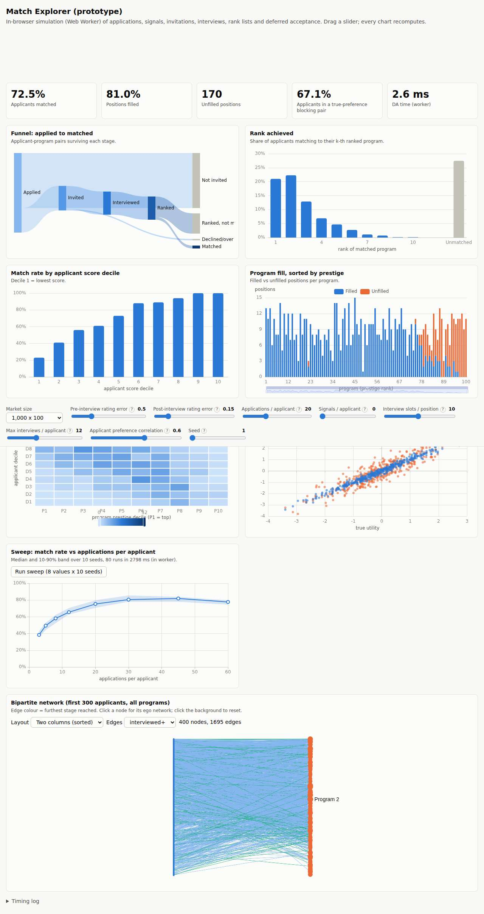

# Match Explorer: visualization prototype

A standalone, no-build prototype from the project review. It shows the proposed chart and slider design ([Appendix E](../E-visualization.md)) running the *whole* planned pipeline in the browser. **It is not part of the app.**



## Run it

```bash
cd docs/review/viz-prototype
python3 -m http.server 8811
# open http://localhost:8811/
```

It must be served over HTTP, because the Web Worker does not load from `file://`. The four libraries load from pinned jsDelivr URLs: `echarts@6.1.0`, `graphology@0.26.0`, `graphology-library@0.8.0` and `sigma@3.0.3`. These are byte-identical to the npm tarballs the review tested with. To work offline, download them into `vendor/` and change the `<script>` tags.

Correctness and timing check (Node):

```bash
node bench.js   # "DA blocking pairs wrt submitted ROLs over 200 random instances (must be 0): 0", then timings per market size
```

## What it does

| File | Contents |
|---|---|
| `sim.js` | The pipeline: population → true utilities → pre-interview observed (additive noise) → top-A applications and signals → program invitations (slots per position × capacity, signal boost) → applicant interview limit → post-interview observed → rank lists → **applicant-proposing deferred acceptance** → metrics. The metrics are the funnel, rank achieved, match by decile, program fill, a decile heatmap, true-preference blocking pairs, a true-vs-observed sample and network edges. |
| RNG (in `sim.js`) | Counter-based: a hash of (seed, stream, i, j). Every slider position reuses the same noise draws (**common random numbers**), and the generator can be reproduced exactly in numpy (Appendix A §3). |
| `worker.js` | Runs `sim.js` off the main thread. Coalesces slider events so only the latest parameters are computed. Runs the Monte-Carlo sweep. |
| `index.html` | 8 sliders with `?` help, a market-size selector, 5 KPI tiles and 7 ECharts charts: Sankey funnel, rank achieved, match by decile, program fill with dataZoom, assortativity heatmap with visualMap, true-vs-observed scatter with Spearman, and a sweep band. There is also a sigma.js bipartite network (sorted two-column or ForceAtlas2 layout, stage filter, click for the ego network). Light and dark themes via CSS tokens; no horizontal overflow at 390 px. |

Timings measured in the review (Chromium, worker round trip):

| Market | Time per update | Suitable for |
|---|---|---|
| 1,000 × 100 | 35–80 ms | dragging a slider |
| 5,000 × 500 | about 0.5 s | updating on release |
| 10,000 × 1,000 | about 1.8 s | |

Deferred acceptance itself takes 2–13 ms at every size.

## Caveats

- **Different model.** It uses a simple model: $U=\sqrt\rho\cdot\text{prestige}+\sqrt{1-\rho}\cdot\varepsilon$ and $V=\sqrt\rho\cdot\text{score}+\sqrt{1-\rho}\cdot\eta$. This is neither the repo's current model nor the proposed [Appendix A](../A-model-spec.md) v2 spec. Numbers such as "72.5% matched" are **illustrative and uncalibrated**. A production Explorer (Plan 7.2) must port the adopted spec and pass parity tests against the Python engine.
- The sticky slider bar overlaps chart cards when you scroll. The network is rebuilt on each update instead of updated through reducers. The `?` help uses `title` tooltips rather than the accessible popover proposed in Appendix F. It is a prototype.
